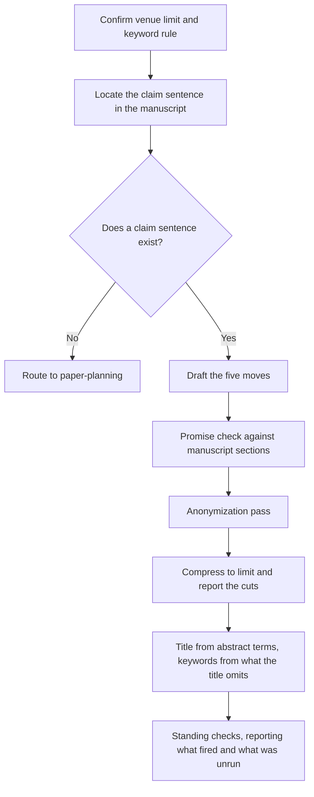

# Abstract Construction Guide

How an anthropological abstract is built, compressed, and checked. For word
limits, keyword rules, structured templates, and title construction, see
[venue-requirements-guide.md](venue-requirements-guide.md).

## The Five Moves

Every abstract for an anthropological article does five things. They are
usually five sentences, but under a tight limit they merge; what is not
permitted is dropping one silently.

### 1. Scene

Name the situation. A reader should be able to picture where the article
happens before they learn what it argues.

The generic opening ("This article explores questions of belonging in
contemporary society") delays the article by a full sentence and tells the
reader nothing they could not have guessed. The specific opening does the same
work in the same space and buys credibility:

> On the medical wards of a public hospital in northern England, a patient is
> discharged twice: once by a clinician, and again by a bed manager weighing
> whether anyone at home can take them back.

Concreteness here is constrained by the manuscript's anonymization
commitments. See "The anonymization pass" below.

### 2. Problem

Say what is analytically at issue in that scene. This is the move that turns a
setting into a paper. It usually takes the form of a tension, a puzzle, or a
thing that is not what it appears to be.

Not: "Little research has examined this." That is a gap statement, and a gap is
not a problem — the absence of a literature does not make a question worth
asking. The problem move says why the scene resists an obvious reading.

### 3. Evidence

State what stands behind the claim: the kind of research, its extent, and where
it happened. In anthropology this is a credential, not a methods note, and its
absence is read as thin fieldwork.

Enough:

> Drawing on fourteen months of ethnographic fieldwork in two municipal
> clinics
> Based on interviews with thirty-one returned labor migrants and two years of
> participant observation in the town's hiring halls
> Working from a corpus of 40,000 forum posts collected between 2019 and 2022

Not enough: "Using qualitative methods," "Drawing on ethnographic research,"
"Through fieldwork." These say only that the author did anthropology.

The evidence move is where autoethnographic and archival work declares itself,
and where a multi-sited design has to be visible, because a reader who
discovers the second site in the article will wonder what else was withheld.

### 4. Claim

State what the article argues, in the article's own terms. This is the sentence
the whole abstract exists to deliver, and it should be recognizable as an
argument someone could disagree with.

Test it: can a competent reader in the subfield disagree with this sentence? If
not, it is a topic statement wearing a claim's clothes. "This article examines
how waiting shapes care" is a topic. "Waiting is not a neutral interval but a
distributed form of harm" is a claim.

If the article coins a term, the term appears here **with its definition**, not
merely with its name. An abstract that announces a concept it does not define
has spent its most valuable words advertising rather than arguing, and for many
readers the abstract is the only place the definition will ever appear.

### 5. Stake

Say which conversation the article enters and what changes in it. This is the
move that distinguishes an article from a report.

Name the conversation by its terms rather than by a roster of theorists:
"debates on obstetric racism and maternal mortality" rather than "the work of
several scholars." Naming a theorist the article barely uses is a common and
checkable overclaim.

## Sentence-Level Craft

**Tense.** The claim and the article's own actions take the present ("This
article argues," "I show," "the analysis reveals"). Completed fieldwork takes
the past ("I worked alongside," "participants described"). Mixing these within
one clause is the most common tense error.

**Voice.** Active. "I trace how" and "This article argues" both work;
"It is argued that" wastes three words and hides the agent, which in a
discipline that treats positionality as evidence is a substantive loss, not
only a stylistic one.

**First person.** Standard in sociocultural and linguistic anthropology, less
so in archaeology and biological anthropology. Follow the manuscript. An
abstract in third person attached to an article written in first person reads
as though it was written by someone else.

**Jargon.** The abstract is read by people outside the subfield: editors
triaging submissions, reviewers deciding whether to accept an invitation, and
scholars in adjacent fields. Terms internal to a theoretical tradition need
either a gloss or a cut. Cultural Anthropology's guidelines put the standard
plainly, asking for a title and abstract "written with minimal jargon for a
broad anthropological audience."

**Acronyms.** Expand on first use or cut. An abstract that opens with an
unexpanded institutional acronym loses the reader in its first four words.

**No citations.** The abstract stands alone. Positions are named, not cited.

**Numbers.** Include them where they are the finding or the credential
(corpus size, months in the field, number of interviews). Avoid them where they
imply a sampling claim the study does not make. "Most participants" is honest
for thirty-one interviews; "80 percent of participants" implies a
representativeness the design does not support.

## The Anonymization Pass

The scene and evidence moves are where an abstract breaks a commitment the
manuscript kept. The abstract is indexed permanently and circulates without the
article, so it deserves its own pass rather than inheriting the manuscript's.

Check three things:

1. **Pseudonym consistency.** Every name in the abstract matches the
   manuscript's pseudonyms. A real place name in the abstract and a pseudonym
   in the text is a straightforward disclosure.
2. **Triangulation.** Region plus institution type plus date range can
   identify a single site even when none of the three names it. Ask whether
   someone who knows the region could name the clinic.
3. **Blind review.** For double-anonymous submission, check whether the scene
   move identifies the author by way of a fieldsite they are known for.

The research-writing skill carries the full anonymization guide, including the
restoration map for the accepted version.

## Compression

Cutting to a limit is where honesty is lost, because the first casualties are
the qualifiers that kept the claim true.

**Priority order when cutting.** Remove in this order, and stop as soon as the
count is met:

1. Literature and background beyond one clause.
2. Method detail beyond kind and extent.
3. Secondary findings.
4. Adjectives and adverbs that do not change the claim's truth conditions.
5. The stake move, merged into the claim rather than deleted.

**Never cut.** Scope conditions, the definition of a coined term, the evidence
move, and anything that qualifies the claim. If the count cannot be met without
touching these, the claim is too large for the abstract, which usually means it
is too large for the article.

**Techniques that save words without cost.**

- Merge scene and problem: "Discharge is decided twice on these wards, and
  the second decision is about the household, not the patient."
- Replace a nominalization with its verb: "conducted an examination of" becomes
  "examined."
- Delete the frame: "In this article, I argue that X" becomes "I argue that X,"
  or often just "X."
- Convert a clause to a modifier: "which took place over fourteen months"
  becomes "fourteen-month."

**Report the cuts.** Present the shortened abstract with a list of what was
removed. The author can then spend restored words deliberately rather than
discovering later that the scope condition is gone.

## The Promise Check

Walk the abstract one sentence at a time and name the manuscript section that
delivers each. Produce a table:

| Abstract sentence | Delivered in | Status |
|---|---|---|
| Claim that the threshold of need relocates to the household | Sections 3 and 5 | Delivered |
| "across the National Health Service" | Nowhere; the fieldwork is one hospital | Overclaim |
| Mentions affect theory | Cited once, not used | Unsupported |

Three outcomes, and the author decides which applies: the abstract overclaims
and should be cut, the manuscript is missing work the author intended, or the
abstract is describing work that exists under a different name in the text.

## Workflow

## Annotated Examples

The abstracts below describe an invented study. They are written for this
guide rather than adapted from published work, so they can be annotated
without putting words in a real author's mouth or reproducing their abstract.
Read recent abstracts from the target journal alongside them.

### Strong: an interpretive claim with a coined term

> On the medical wards of a public hospital in northern England, the decision
> to discharge a patient is made twice: once by a clinician, and again, often
> days later, by a bed manager weighing whether anyone at home can take the
> patient back. This article calls the second decision *capacity triage*: the
> rationing of hospital beds by an assessment of a household's capacity to
> absorb care rather than of a patient's readiness to leave. Drawing on eleven
> months of fieldwork alongside discharge coordinators and the families of
> forty-three patients waiting on delayed discharge, I argue that capacity
> triage moves the threshold of medical need out of the clinic and into the
> household, where it is assessed without being named as a clinical judgment
> at all. The article contributes to debates on austerity, care work, and
> medical rationing by showing that a bed shortage is resolved through
> judgments about kin.

- **Scene** is specific and does analytical work in its first clause: the
  puzzle is visible before any theory arrives.
- **Problem** is embedded in the scene rather than announced. A decision made
  twice, by two parties, on two criteria, is a problem without needing to be
  called one.
- **Coined term** appears with its definition in the same sentence.
- **Evidence** gives kind, extent, and the two vantage points that make the
  case sharp.
- **Claim** is disagreeable. A reader could hold that this is ordinary
  discharge planning under resource pressure rather than a relocated
  threshold, and that disagreement is the article's stake.
- **Stake** names the conversation by its terms and says what changes in it.

### Weak: the same study, mishandled

> This article explores questions of care and decision-making in the context
> of contemporary healthcare systems. Hospital discharge has been widely
> discussed in recent scholarship, and important work has examined its social
> dimensions. Using qualitative methods, this study examines discharge
> practices at a hospital in Europe. It is argued that families play an
> important role. The findings have significant implications for our
> understanding of care, institutions, and society.

- **Background creep**: two sentences pass before the article appears, and
  the second is a gap statement that names no gap.
- **No scene**: "a hospital in Europe" could be forty thousand hospitals, and
  the vagueness protects nobody — it is imprecision, not anonymization.
- **Evidence is a placeholder**: "using qualitative methods" tells an
  anthropologist nothing about what stands behind the reading, and the
  eleven months and forty-three families have vanished.
- **The claim is a topic**: "families play an important role" is something
  nobody would dispute, which is how you know it is not an argument.
- **Passive construction hides the author** in a discipline where the
  author's position is evidence.
- **The stake is inflated and empty**: "care, institutions, and society" is
  three fields and no conversation.
- **The coined term is gone**, and with it the article's contribution.

### Repairing the weak version

Each repair is mechanical once the failure is named: restore the site, replace
the gap statement with the puzzle, state the fieldwork and its extent, convert
the topic into a claim someone could resist, reinstate the term with its
definition, and replace the three-field flourish with the specific debate the
article enters.

## Revision Checklist

- [ ] All five moves present, or deliberately merged rather than dropped.
- [ ] The claim is disagreeable, not a topic statement.
- [ ] Any coined term is defined, not only named.
- [ ] The evidence move states kind and extent.
- [ ] Scope conditions match the manuscript's conclusion.
- [ ] Every sentence maps to a manuscript section (promise check run).
- [ ] Pseudonyms consistent; scene does not triangulate to a protected site.
- [ ] Tense consistent: present for the argument, past for completed work.
- [ ] Active voice; person matches the manuscript.
- [ ] No citations; no unexpanded acronyms; no undefined subfield jargon.
- [ ] Within the venue's word limit, confirmed against current guidelines.
- [ ] Cuts reported to the author rather than made silently.
