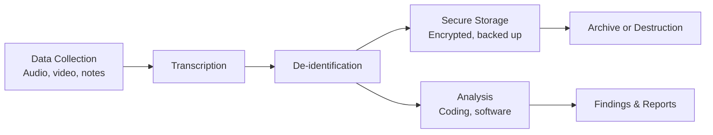

# Data Management Guide for Qualitative and Ethnographic Research

This reference covers data management planning, storage, security, transcription,
de-identification, sharing, and retention for anthropological fieldwork.

---

## 1. Data Management Plan Structure

A data management plan (DMP) describes how data will be collected, organized, stored,
secured, shared, and preserved throughout a research project. For qualitative research,
the DMP must address unstructured data, evolving collection methods, and the heightened
confidentiality obligations of work with human participants.

### When a DMP Is Required

- **NSF** -- Supplementary DMP required (up to two pages).
- **NIH** -- Data management and sharing plans required for all funded research.
- **Wellcome Trust** -- Outputs management plan covering data sharing.
- **EU Horizon Europe** -- DMP following FAIR principles.
- **Institutional** -- Many universities require DMPs for all human participants research.

### How Qualitative DMPs Differ from Quantitative

- **Unstructured data** -- Audio, field notes, photographs, and video do not fit database formats.
- **Evolving data types** -- Ethnographic research generates unanticipated data forms. Treat the DMP as a living document.
- **Confidentiality complexity** -- Context and narrative detail can make participants identifiable even without names.
- **Consent complexity** -- Participants may consent to some uses but not others.

### DMP Template

```
DATA MANAGEMENT PLAN: [Study Title]

1. DATA TYPES AND FORMATS
   - Audio recordings: [format, e.g., WAV/MP3]
   - Video recordings: [format, if applicable]
   - Photographs: [format, consent requirements]
   - Field notes: [handwritten/digital, format]
   - Interview transcripts: [format, e.g., Word/plain text]
   - Focus group transcripts: [format]
   - Analytical memos: [format]
   - Consent forms: [paper/digital]
   - Demographic data: [format, if collected]

2. DATA COLLECTION
   - Recording equipment and procedures
   - File naming conventions: [specify]
   - Metadata to capture: [date, participant code, method, location]

3. STORAGE AND SECURITY
   - Primary storage: [location, encryption]
   - Backup: [location, frequency]
   - Access controls: [who has access, how managed]
   - Field storage: [procedures during active fieldwork]

4. DE-IDENTIFICATION
   - Pseudonym system: [how assigned]
   - What identifiers are removed: [names, locations, organizations, dates]
   - When de-identification occurs: [during transcription / after]
   - Master key: [where stored, who has access, when destroyed]

5. TRANSCRIPTION
   - Who transcribes: [researcher / professional service / community member]
   - Transcription conventions: [verbatim / cleaned / notation system]
   - Quality assurance: [review process]
   - Timeline: [when transcription occurs relative to collection]

6. DATA SHARING AND ACCESS
   - Will data be shared: [yes/no, justification]
   - Repository: [if applicable]
   - Access conditions: [open / restricted / embargo period]
   - Participant consent for sharing: [what was consented to]

7. RETENTION AND DESTRUCTION
   - Retention period: [how long, per what requirement]
   - What is destroyed when: [recordings, linking keys, raw notes]
   - Destruction method: [secure deletion, shredding, degaussing]
   - Documentation of destruction: [audit trail]
```

---

## 2. Data Storage and Security

### Storage Infrastructure

| Option | Advantages | Considerations |
|--------|-----------|----------------|
| Institutional servers | IT-managed security, backup, compliance | Limited field access |
| Encrypted external drives | Portable, no internet required | Risk of loss/theft |
| Institutional cloud (OneDrive, Google Workspace) | Accessible, backed up | Verify compliance policies |
| Commercial cloud (Dropbox, AWS) | Flexible, scalable | May not meet GDPR/institutional requirements |

### Encryption

- **At rest** -- Use FileVault (macOS), BitLocker (Windows), or VeraCrypt for full-disk encryption.
- **In transit** -- Use SFTP, institutional VPN, or encrypted email. Never send identifiable data unencrypted.

### Field Storage Challenges

- **Portable encrypted drives** -- Carry at least two. Back up daily. Store separately.
- **Limited internet** -- Maintain local encrypted copies; upload to cloud when connectivity permits.
- **Physical security** -- Use locked containers for drives, notebooks, and recording devices.

### Cloud and Access Considerations

- Verify GDPR compliance and data sovereignty requirements before fieldwork.
- Consult institutional data governance policies on permitted cloud services.
- Apply least privilege: each team member accesses only the data their role requires.
- For multi-site research, establish a single data transfer protocol and consistent naming conventions before fieldwork begins.

### Physical Security

Store paper consent forms in a locked cabinet, separate from data. Keep field notebooks locked when not in use. Shred paper with identifiers when no longer needed.

---

## 3. File Organization and Naming

### Naming Convention

Pattern: `[ParticipantCode]_[Method]_[Date]_[Version].[ext]`

| Code | Data Type | Example |
|------|-----------|---------|
| INT | Interview | `P01_INT_20250315_v1.docx` |
| FG | Focus group | `FG02_TRANS_20250320_v2.docx` |
| OBS | Observation | `OBS_SiteA_20250318.docx` |
| MEMO | Analytical memo | `MEMO_ThemeX_20250401.docx` |
| AV | Audio/video | `P07_AV_20250401.wav` |

Rules: no spaces (use underscores), ISO 8601 dates (YYYYMMDD), version numbers for revisions, never include real names.

### Folder Structure

```
ProjectName/
├── 01_RawData/
│   ├── Audio/
│   ├── Video/
│   ├── Photos/
│   └── FieldNotes_Handwritten/
├── 02_Transcripts/
│   ├── Interviews/
│   ├── FocusGroups/
│   └── FieldNotes_Typed/
├── 03_DeIdentified/
│   ├── Transcripts/
│   └── FieldNotes/
├── 04_Analysis/
│   ├── Codebooks/
│   ├── Coding/
│   └── Memos/
├── 05_ConsentForms/
├── 06_Instruments/
│   ├── InterviewGuides/
│   ├── ObservationProtocols/
│   └── FocusGroupGuides/
├── 07_Admin/
│   ├── IRB/
│   ├── ParticipantLog/
│   └── MasterKey/  [restricted access]
└── README.txt  [project description, file naming key]
```

### Data Inventory and Version Control

Maintain a data inventory tracking file name, data type, participant code, collection date, transcription date, de-identification status, storage location, and processing status.

For instruments (interview guides, observation protocols), save each version with a version number, maintain a change log, and record which participants were interviewed with which guide version.

---

## 4. Transcription Protocols

**Verbatim transcription** records every utterance including false starts, filler words, and repetitions. This is the standard for anthropological interview research.

**Intelligent verbatim** removes filler words and false starts. Appropriate when the focus is thematic content rather than speech patterns.

### Notation System

| Symbol | Meaning |
|--------|---------|
| (.) | Brief pause (under 1 second) |
| (..) | Longer pause (1-3 seconds) |
| (...) | Extended pause (3+ seconds) |
| [laughs] | Non-verbal sounds |
| [inaudible] | Cannot be understood |
| [crosstalk] | Overlapping speech |
| CAPS | Emphasis/raised voice |
| -- | Self-correction or interruption |
| ... | Trailing off |

### Transcription Header

```
Transcript ID: [code]
Date of interview: [date]
Duration: [minutes]
Participant: [pseudonym]
Interviewer: [name/code]
Location: [general, not specific]
Language: [language(s) used]
Transcribed by: [name] | Date: [date]
Reviewed by: [name] | Date: [date]
```

### Translation and Transcription

Transcribe first in the original language. Translate selected passages as needed. Use back-translation for key passages to verify accuracy. Include original language quotes in footnotes when concepts do not translate directly. Document translator qualifications and dialect familiarity.

### Quality Assurance

- Review transcripts against audio to catch errors and verify accuracy.
- Offer participant review (member checking) as both a quality and ethical practice.
- When multiple people transcribe, compare a sample for inter-transcriber reliability.

### Outsourcing Transcription

Execute confidentiality agreements before sharing recordings. Transfer via encrypted channels only. Provide notation system and context. Review all outsourced transcripts against audio. Verify the service does not retain copies.

---

## 5. De-identification and Confidentiality

### Levels of Identifiability

| Level | Description |
|-------|-------------|
| Identifiable | Direct identifiers present (name, address, face photo) |
| Potentially identifiable | Indirect identifiers that could identify in combination |
| De-identified | Direct identifiers removed; indirect identifiers reduced |
| Anonymized | Re-identification not reasonably possible |

Full anonymization of qualitative data is often impossible. The practical goal is de-identification to an acceptably low risk of re-identification.

### What to De-identify

Names, place names, organization names, specific dates, unique roles/titles, physical descriptions, and unique events that could identify participants.

### Pseudonym Systems

Assign pseudonyms at transcription. Use them consistently across all documents. Choose culturally appropriate names. For oral history with attribution consent, real names may be retained.

### Location and Context

Use general regional descriptors for small communities. Consider composite locations when ethnographic specificity is needed but identification would cause harm. Assess whether combined contextual details could narrow identification.

### Master Linking Key

Contains real name, code, pseudonym, contact info, and consent date. Store separately from data on an encrypted device with access restricted to the PI. Destroy at end of retention period and document the destruction.

### Challenges in Anthropology

Small communities where context is identifying even without names. Public figures requiring explicit attribution discussion. Participants who prefer to be named, particularly in oral history or advocacy contexts.

### De-identification Checklist

- [ ] All personal names replaced with pseudonyms
- [ ] Place names generalized or changed
- [ ] Organization names removed or generalized
- [ ] Dates generalized where appropriate
- [ ] Unique identifying details removed or altered
- [ ] Transcript headers contain only codes
- [ ] Audio/video files named with codes, not names
- [ ] Master key stored separately with restricted access
- [ ] Consent forms stored separately from data
- [ ] Reviewed by a second team member for residual identifiers

---

## 6. Data Sharing and Archiving

Funders increasingly expect data sharing, but qualitative researchers must balance this against confidentiality obligations and relational ethics.

**Share when:** transcripts are thoroughly de-identified, topics are not sensitive, participants consented to sharing, and data has reuse value.

**Do not share when:** topics are sensitive, communities are small, participants did not consent, or sharing violates community data governance protocols.

### Repository Options

| Repository | Focus | Access Options |
|-----------|-------|----------------|
| Qualitative Data Repository (QDR) | Qualitative/multi-method | Open, restricted, embargoed |
| ICPSR | Social science broadly | Variable |
| UK Data Service | UK-funded research | Registered, safeguarded, controlled |
| Institutional repositories | Varies | Varies |

### Preparing Data for Deposit

Conduct final de-identification review. Create metadata records. Write a README documenting contents and conventions. Specify access conditions. Assign a persistent identifier (DOI).

### Indigenous Data Sovereignty

- **CARE Principles** -- Collective benefit, Authority to control, Responsibility, Ethics.
- **OCAP Principles** -- Ownership, Control, Access, Possession (First Nations in Canada).
- Negotiate community data agreements before fieldwork. Provide data copies to the community.

---

## 7. Retention and Destruction

### Retention Requirements

- **NSF** -- Three years after final project report.
- **NIH** -- Per the data management and sharing plan.
- **Institutional** -- Typically five to seven years after publication.
- **IRB** -- Follow the approved protocol's specified timelines.

Retain de-identified transcripts, codebooks, analytical memos, instruments, and IRB documentation.

### What to Destroy and When

| Data Type | Destroy When | Method |
|-----------|-------------|--------|
| Audio/video recordings | After transcription verified + retention period | Secure digital deletion |
| Master linking key | After retention period or when unneeded | Secure deletion + documentation |
| Raw notes with identifiers | After de-identified versions verified | Shredding or secure deletion |
| Consent forms | After retention period | Shredding |

### Destruction Methods

Secure digital deletion (overwrite, not just trash). Physical cross-cut shredding. Degaussing for magnetic media. For encrypted drives, destroying the encryption key suffices. Document all destruction with a certificate for IRB compliance.

---

## 8. Data Handling Workflow



- Transcribe within one to two weeks of collection while context is fresh.
- Complete de-identification before sharing data with research assistants for coding.
- Encrypt and back up from the moment of collection through every stage.
- Conduct analysis from de-identified copies; retain identified data only for verification.
- Follow the retention schedule for archiving or destruction decisions.

---

## 9. Data Management Checklists

### Pre-Fieldwork

- [ ] DMP drafted and approved
- [ ] File naming conventions established and documented
- [ ] Folder structure created on encrypted storage
- [ ] Encryption enabled on all devices holding research data
- [ ] Backup procedures tested
- [ ] Pseudonym system designed and master key template created
- [ ] Transcription protocol written
- [ ] Confidentiality agreements prepared for transcribers and assistants
- [ ] Secure file transfer method tested
- [ ] Recording equipment tested with backup identified
- [ ] Participant log and data inventory templates created
- [ ] IRB protocol reviewed for data-specific requirements
- [ ] Community data agreements negotiated (if applicable)
- [ ] Team trained on data management procedures

### During Fieldwork

**Daily:** Back up recordings/notes to encrypted drive. Verify recordings are audible. Assign codes and update participant log. Name files per convention. Secure devices overnight.

**Weekly:** Upload to cloud (if connectivity allows). Update data inventory. Begin transcription if feasible. Type handwritten field notes. Verify encryption. Confirm consent forms stored separately.

### Post-Fieldwork

- [ ] All recordings transferred to secure institutional storage
- [ ] All field notes typed and filed
- [ ] Transcription completed and reviewed against audio
- [ ] De-identification completed and reviewed by second team member
- [ ] Master key verified, secured, access restricted
- [ ] Data inventory finalized
- [ ] Consent forms inventoried and secured
- [ ] Data copies provided to community (if agreed)
- [ ] Field devices wiped after verified transfer
- [ ] Repository deposit completed (if applicable)
- [ ] Destruction schedule documented
- [ ] IRB closeout submitted with data status update
