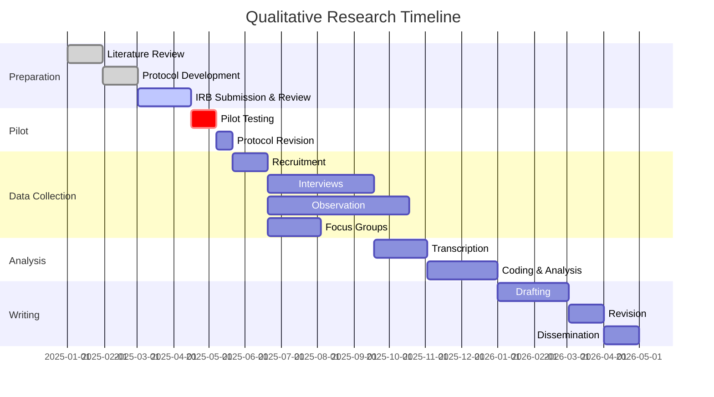

# Protocol Design Guide for Anthropological Research

This reference covers the design, structure, and refinement of research protocols
for qualitative and ethnographic fieldwork. It addresses protocol organization,
sampling and recruitment, researcher training and reflexivity, pilot testing,
project planning, and checklists for protocol completeness.

---

## 1. Protocol Structure and Organization

### Purpose of a Research Protocol in Anthropology

A research protocol in anthropology serves as the foundational planning document
for a study. It articulates the research questions, theoretical grounding,
methodological approach, ethical safeguards, and logistical plan. Unlike protocols
in clinical or experimental research, anthropological protocols must balance
structure with ethnographic flexibility. The protocol establishes the scaffolding
within which emergent, iterative inquiry can take place.

A well-constructed protocol accomplishes several goals:

- Communicates the study design to ethics boards, funders, and collaborators
- Provides a reference point for methodological decisions during fieldwork
- Documents the intended approach for transparency and reproducibility
- Serves as a training tool for research team members
- Creates an audit trail when modifications occur during data collection

### Core Sections of a Qualitative Research Protocol

A comprehensive anthropological research protocol typically includes the following
sections, though not every context requires every section:

1. **Title and Summary** -- A concise title and an abstract or executive summary
   of the study (typically 250-500 words).

2. **Background and Objectives** -- Review of relevant literature, identification
   of gaps, and statement of research objectives or questions. In anthropology,
   this section often foregrounds the ethnographic context and situates the study
   within broader disciplinary conversations.

3. **Theoretical Framework** -- The intellectual tradition guiding the study
   (e.g., practice theory, political ecology, phenomenology, structural violence).
   This section explains how the framework shapes the research questions and
   analytical approach.

4. **Study Site and Duration** -- Description of the field site(s), rationale for
   site selection, anticipated duration of fieldwork, and any preliminary
   relationships with the community or institution.

5. **Investigators and Team** -- Identification of the principal investigator,
   co-investigators, research assistants, community researchers, translators, and
   their respective roles.

6. **Participants** -- Description of the study population, inclusion and exclusion
   criteria, and anticipated number of participants. In anthropological work, this
   section should address the relationship between the researcher and the community.

7. **Sampling Strategy** -- The approach to selecting participants, described in
   detail (see Section 2 below).

8. **Methods** -- Detailed description of each data collection method (interviews,
   participant observation, focus groups, surveys, archival research, visual
   methods, etc.), including instruments, recording procedures, and language
   considerations.

9. **Data Management** -- Plans for data storage, transcription, translation,
   de-identification, backup, and security. Must address both digital and physical
   data (field notebooks, consent forms, recordings).

10. **Analysis Plan** -- The analytical approach (e.g., thematic analysis, grounded
    theory coding, narrative analysis, discourse analysis), software to be used,
    coding procedures, and strategies for rigor (member checking, triangulation,
    peer debriefing).

11. **Ethics** -- Informed consent procedures, confidentiality protections, risk
    mitigation, community benefit, and plans for handling sensitive disclosures.
    This section should address community-level as well as individual ethics.

12. **Timeline** -- A phased schedule for the study from preparation through
    dissemination (see Section 5 below).

13. **Budget** -- Itemized costs including personnel, travel, equipment,
    transcription, translation, participant compensation, software, and
    dissemination.

14. **Dissemination Plan** -- How findings will be shared with academic audiences,
    community partners, policymakers, and participants.

15. **Appendices** -- Interview guides, observation protocols, consent forms,
    recruitment materials, codebooks, and other instruments.

### How Anthropological Protocols Differ from Clinical or Quantitative Protocols

Anthropological research protocols diverge from clinical trial or survey-based
protocols in several important ways:

- **Iterative design.** Anthropological protocols anticipate that methods,
  questions, and even theoretical framing may evolve during fieldwork. The protocol
  documents the starting point and the process for managing change, rather than
  locking in a fixed procedure.

- **Adaptive methods.** Interview guides are typically semi-structured, observation
  protocols are open-ended, and the researcher retains discretion to follow
  emergent lines of inquiry. The protocol describes the range of methods and the
  principles guiding their use, not a rigid script.

- **Emergent questions.** New research questions frequently arise during fieldwork.
  The protocol should include language acknowledging this possibility and
  describing the process for documenting and pursuing emergent questions.

- **Relationship-centered ethics.** Anthropological ethics extend beyond individual
  informed consent to encompass community relationships, reciprocity, and long-term
  obligations. The protocol should address these relational dimensions.

- **Longer timeframes.** Ethnographic fieldwork often spans months or years, and
  protocols must account for the evolving nature of extended engagement.

### Protocol as a Living Document

The protocol should be treated as a living document. It is not a contract that
binds the researcher to a fixed plan, but a framework that evolves with the
research. Changes to the protocol should be:

- Documented with dates and rationale
- Reported to the ethics board when required (amendments)
- Reflected in the final methods section of publications
- Discussed transparently in reflexive memos and field journals

### Protocol Sections by Context

Not every context requires the same level of detail. The following table indicates
which sections are typically required or optional across common use cases.

| Protocol Section         | Dissertation Proposal | Grant Application | IRB Submission | Standalone Protocol |
|--------------------------|-----------------------|-------------------|----------------|---------------------|
| Title and Summary        | Required              | Required          | Required       | Required            |
| Background/Objectives    | Required              | Required          | Required       | Required            |
| Theoretical Framework    | Required              | Required          | Optional       | Required            |
| Study Site/Duration      | Required              | Required          | Required       | Required            |
| Investigators/Team       | Optional              | Required          | Required       | Required            |
| Participants             | Required              | Required          | Required       | Required            |
| Sampling Strategy        | Required              | Required          | Required       | Required            |
| Methods                  | Required              | Required          | Required       | Required            |
| Data Management          | Optional              | Required          | Required       | Required            |
| Analysis Plan            | Required              | Required          | Optional       | Required            |
| Ethics                   | Required              | Required          | Required       | Required            |
| Timeline                 | Required              | Required          | Optional       | Required            |
| Budget                   | Optional              | Required          | Optional       | Optional            |
| Dissemination Plan       | Optional              | Required          | Optional       | Optional            |
| Appendices (instruments) | Required              | Required          | Required       | Required            |

---

## 2. Sampling and Recruitment Strategies

### Purposive Sampling

Purposive sampling involves the deliberate selection of participants based on
specific criteria or the researcher's judgment about who can provide the most
relevant information. This is the most common sampling strategy in qualitative
anthropological research.

**When to use:** When the research questions require particular types of knowledge,
experience, or social position. For example, selecting elders with specific
ceremonial knowledge, healthcare workers in a particular facility, or migrants
from a defined origin region.

**Strengths:** Directly targets information-rich cases. Efficient use of limited
fieldwork time. Allows the researcher to ensure coverage of relevant perspectives.

**Limitations:** Relies on the researcher's judgment, which may reflect biases or
incomplete understanding of the community. May miss unexpected perspectives.

### Snowball Sampling

Snowball sampling recruits participants through referrals from existing
participants. Each participant is asked to suggest others who might be willing and
relevant to the study.

**When to use:** When the study population is hard to reach, hidden, or tightly
knit. Common in studies of undocumented migrants, people who use criminalized
substances, informal economic networks, or dispersed diaspora communities.

**Strengths:** Provides access to populations that cannot be identified through
institutional records or public directories. Builds on existing social trust.

**Limitations:** Biased toward socially connected individuals. May over-represent
particular networks or factions within a community. Those who are socially
isolated or in conflict with initial participants are likely to be missed.

### Criterion Sampling

Criterion sampling selects all participants who meet one or more predefined
criteria. Every individual who meets the inclusion criteria and is available is
recruited.

**When to use:** When the research focuses on a specific, bounded group defined by
shared characteristics (e.g., all traditional birth attendants in a district, all
members of a cooperative, all patients diagnosed in a specific time window).

**Strengths:** Comprehensive within the defined group. Reduces selection bias
within the target population.

**Limitations:** The criteria may be too narrow or too broad. Does not account for
variation within the group unless combined with other strategies.

### Theoretical Sampling

Theoretical sampling is an iterative process in which participant selection evolves
based on emerging analytical categories. It is most closely associated with the
grounded theory tradition. The researcher collects data, begins analysis, and then
selects subsequent participants to refine, elaborate, or challenge developing
theoretical constructs.

**How it differs from purposive sampling:** Purposive sampling is planned in
advance based on existing knowledge. Theoretical sampling is responsive and
ongoing, driven by the analysis itself. The researcher does not know at the outset
who all the participants will be.

**When to use:** When the goal is theory development rather than description. When
the research questions are broad enough to allow the analysis to guide sampling.

**Strengths:** Produces theoretically grounded findings. Ensures that emerging
categories are fully developed and tested against new data.

**Limitations:** Requires concurrent data collection and analysis. Difficult to
plan for in advance, which can complicate IRB submissions and timelines.

### Maximum Variation Sampling

Maximum variation sampling seeks the widest possible range of perspectives across
key dimensions of difference (e.g., age, gender, occupation, geographic location,
socioeconomic status, political affiliation).

**When to use:** When the research aims to capture the full breadth of experience
within a phenomenon. When the goal is to identify common patterns that cut across
diverse cases.

**Strengths:** Produces findings that account for diversity. Strengthens the
transferability of findings by demonstrating patterns across varied contexts.

**Limitations:** Requires sufficient knowledge of the population to identify
relevant dimensions of variation. May result in smaller numbers within any single
subgroup.

### Convenience Sampling

Convenience sampling recruits whoever is available and willing. Participants are
selected based on accessibility rather than strategic criteria.

**When acceptable:** In highly exploratory or pilot phases of research. When access
is severely constrained. When the study population is homogeneous and selection
criteria are not meaningful.

**When to avoid:** When the research questions require specific types of
knowledge or experience. When findings will be used to make claims about a
defined population. In most funded or IRB-reviewed research, convenience sampling
alone is insufficient justification.

### Saturation

Saturation refers to the point at which additional data collection yields no new
analytical insights. It is not a fixed number but a judgment based on the richness
and depth of the data.

**Planning for saturation:**

- Estimate an initial sample size based on methodology and scope
- Build in the possibility of additional recruitment if saturation is not reached
- Document the process of assessing saturation in memos and the methods section

**Documenting saturation:**

- Note when new interviews or observations stop generating new codes or themes
- Record the decision-making process in field notes or analytical memos
- Report the basis for the saturation claim in publications

### Sample Size in Qualitative Research

Sample size in qualitative research is determined by the research questions, the
methods, the diversity of the population, and the depth of analysis required. It
is not calculated using statistical power formulas.

**Typical ranges by method:**

| Method                | Typical Range       | Notes                                      |
|-----------------------|---------------------|--------------------------------------------|
| Semi-structured       | 15-40 participants  | Varies by topic complexity and population   |
| interviews            |                     | heterogeneity                               |
| Focus groups          | 3-6 groups          | Each group typically includes 5-10          |
|                       | (15-60 total)       | participants                                |
| Participant           | Site-dependent      | Duration matters more than number of        |
| observation           |                     | discrete observations                       |
| Life history/narrative| 5-15 participants   | Depth compensates for smaller numbers       |
| Key informant         | 5-20 informants     | Selected for specialized knowledge          |
| interviews            |                     |                                             |

**Justification strategies:** State the sampling approach, the basis for the
initial estimate, the plan for assessing saturation, and any methodological
literature supporting the chosen range.

### Key Informant Identification

Key informants are individuals with specialized knowledge, extended experience, or
a particular vantage point relevant to the research questions. They are not
representative of the broader population but are selected for the depth and
specificity of their knowledge.

**How to select:** Identify through preliminary fieldwork, community consultation,
literature review, or referrals from other researchers.

**Ethical considerations:** Over-reliance on a small number of gatekeepers can
distort the research by privileging certain perspectives. Key informants may face
risks if their contributions are identifiable. Ensure informed consent addresses
the specific risks of key informant participation.

### Recruitment Processes

Recruitment in anthropological research typically involves several stages:

1. **Community entry** -- Establishing presence and trust in the field site through
   informal engagement, attending community events, and making introductions
   through local contacts.

2. **Building rapport** -- Developing relationships that allow potential
   participants to make informed, voluntary decisions about participation.

3. **Working with gatekeepers** -- Identifying and engaging community leaders,
   institutional authorities, or organizational contacts who can facilitate access.
   Be aware that gatekeeper endorsement can both enable and constrain recruitment.

4. **Institutional access** -- Obtaining permissions from organizations,
   government bodies, or community governance structures as required.

5. **Direct outreach** -- Approaching potential participants through community
   events, public spaces, institutional settings, or referral networks.

### Recruitment Materials

Recruitment materials should be appropriate to the literacy level, language, and
communication norms of the target population. Materials may include:

- Flyers or posters (with clear, plain language)
- Verbal recruitment scripts (for oral cultures or low-literacy settings)
- Community announcements (through local radio, meetings, or leaders)
- Digital outreach (social media, messaging apps, email) where appropriate
- Letters of introduction from community partners or institutional sponsors

All recruitment materials must be reviewed and approved by the relevant ethics
board before use.

### Sampling Strategy Comparison

| Strategy            | When to Use                        | Strengths                        | Limitations                          | Typical Studies                    |
|---------------------|------------------------------------|----------------------------------|--------------------------------------|------------------------------------|
| Purposive           | Specific knowledge needed          | Targets information-rich cases   | Researcher judgment bias             | Most qualitative studies           |
| Snowball            | Hidden or hard-to-reach groups     | Accesses closed networks         | Network bias                         | Migration, substance use, stigma   |
| Criterion           | Bounded, defined population        | Comprehensive within criteria    | May miss variation                   | Clinical, organizational studies   |
| Theoretical         | Theory development (grounded)      | Analysis-driven, rigorous        | Hard to pre-plan                     | Grounded theory studies            |
| Maximum variation   | Breadth of experience needed       | Captures diverse perspectives    | Requires population knowledge        | Cross-cultural, comparative        |
| Convenience         | Exploratory or constrained access  | Practical, low cost              | Weak justification for claims        | Pilot studies, early exploration   |

---

## 3. Researcher Training and Reflexivity

### Training for Research Teams

All members of a research team should receive training before data collection
begins. Training should be documented and may need to be reported to the ethics
board. Core training areas include:

- **Interview technique.** Conducting semi-structured interviews, active listening,
  probing, managing sensitive topics, avoiding leading questions.

- **Consent procedures.** Administering informed consent (written and oral),
  explaining the study, answering questions, documenting consent, and handling
  refusals or withdrawals.

- **Recording equipment.** Operating audio recorders, video equipment, cameras,
  and backup devices. Troubleshooting common technical problems in the field.

- **Cultural protocols.** Appropriate greetings, dress, body language, gift-giving
  norms, gender dynamics, and other context-specific expectations. This training
  should be developed in consultation with community advisors.

- **Safety and security.** Personal safety protocols, emergency contacts,
  communication plans, data security in the field, and procedures for handling
  distressing disclosures or dangerous situations.

- **Data handling.** Labeling files, secure storage, transferring data, maintaining
  confidentiality of physical and digital materials.

### Training for Community Researchers and Navigators

When community members serve as co-researchers, research assistants, translators,
or cultural navigators, they require tailored training that addresses:

- **Research ethics.** Confidentiality obligations, voluntary participation, the
  right to withdraw, and the distinction between research and community work.

- **Methods.** Data collection procedures relevant to their role (interviewing,
  note-taking, translation, recruitment).

- **Confidentiality.** Specific guidance on managing information within the
  community, especially when the community researcher has pre-existing
  relationships with participants.

- **Dual roles.** How to navigate the tension between their role as a community
  member and their role as a researcher. Clear guidance on boundaries, disclosure,
  and managing expectations.

### Reflexivity Statements

A reflexivity statement is a written account of the researcher's positionality and
its potential influence on the research. It should be included in the protocol and
revisited throughout the study.

**What to include:**

- Disciplinary background and training
- Relationship to the community or study population (insider, outsider, or hybrid)
- Language ability and communication considerations
- Cultural background, ethnicity, gender, class, and other relevant social
  positions
- Prior experience in the field site or with the study population
- Assumptions, expectations, and potential biases
- How positionality may affect access, rapport, data collection, and interpretation

**Where it goes in the protocol:** Typically in the methods section, after the
description of the research team or in a dedicated subsection on researcher
positionality. Some funders and journals require it as a separate section.

### COREQ Checklist Items Related to Researcher Characteristics

The Consolidated Criteria for Reporting Qualitative Research (COREQ) checklist
includes several items pertaining to researcher characteristics that should be
addressed in the protocol:

- Which researchers conducted the interviews or focus groups
- Researcher credentials (degree, title)
- Researcher occupation at the time of the study
- Whether the researcher was male or female
- Experience or training in qualitative methods
- Relationship established with participants prior to study commencement
- What participants knew about the researcher (goals, reasons for doing research)
- Characteristics of the interviewer or facilitator reported to participants

Addressing these items in the protocol strengthens both the study design and the
eventual reporting.

### Ongoing Reflexivity Practices

Reflexivity is not a one-time exercise. It should be practiced throughout the
research process through:

- **Field journals.** Regular entries documenting the researcher's emotional
  responses, evolving relationships, surprises, discomforts, and shifting
  perspectives.

- **Team debriefs.** Structured conversations among team members about the
  research process, emerging dynamics, and differing interpretations.

- **Analytical memos.** Written reflections on how the researcher's positionality
  is shaping analytical decisions, coding choices, and theoretical development.

- **Peer consultation.** Seeking feedback from colleagues, mentors, or community
  advisors on how positionality may be influencing the research.

### Managing Insider-Outsider Dynamics

Anthropological fieldwork frequently involves navigating complex insider-outsider
dynamics. Researchers should consider:

- **Insider advantages.** Pre-existing knowledge, language fluency, cultural
  competence, community trust, and access to sensitive topics.

- **Insider challenges.** Assumptions of shared understanding, difficulty
  maintaining analytical distance, community expectations that may conflict with
  research goals, and risks of over-identification.

- **Outsider advantages.** Fresh perspective, ability to ask naive questions,
  reduced entanglement in local politics, and potentially greater freedom to
  publish sensitive findings.

- **Outsider challenges.** Limited access, language barriers, cultural
  misunderstandings, longer time needed to build trust, and the risk of extractive
  research.

- **Hybrid positions.** Many researchers occupy shifting or ambiguous positions.
  The protocol should acknowledge this complexity and describe strategies for
  managing it (e.g., consulting with community members about appropriate
  boundaries, maintaining a reflexive journal).

---

## 4. Pilot Testing and Protocol Iteration

### Purpose of Pilot Testing

Pilot testing evaluates the feasibility and effectiveness of the research protocol
before full-scale data collection begins. It is a critical step in anthropological
research because instruments must work across cultural, linguistic, and contextual
variations that cannot always be anticipated.

Pilot testing serves to:

- Test the clarity and appropriateness of interview questions
- Assess whether observation protocols capture the intended phenomena
- Identify logistical challenges (access, timing, privacy, recording conditions)
- Evaluate the consent process for comprehension and comfort
- Estimate the time required for data collection activities
- Reveal unanticipated sensitivities or ethical concerns
- Test recruitment strategies for feasibility and effectiveness

### What to Pilot

- **Interview guides.** Do the questions make sense to participants? Do they elicit
  the intended depth and type of response? Are any questions confusing, offensive,
  or redundant?

- **Observation protocols.** Are the categories and frameworks useful in practice?
  Can the researcher record observations effectively in real time?

- **Recording equipment.** Does the equipment function reliably in the field
  setting? Is audio quality adequate? Are backup systems in place?

- **Consent processes.** Do participants understand the consent information? Is the
  consent form appropriate for the literacy and language context? Does the oral
  consent script flow naturally?

- **Recruitment strategies.** Are the recruitment methods reaching the target
  population? Are potential participants willing to engage? Are gatekeepers
  facilitating or obstructing access?

### How to Conduct a Pilot

1. **Select a small sample.** Typically 2-5 participants who resemble the target
   population but who will not be included in the final sample (unless the study
   population is very small, in which case pilot participants may be retained).

2. **Conduct data collection as planned.** Follow the protocol as closely as
   possible to identify practical problems.

3. **Gather structured feedback.** After each pilot session, ask participants
   about their experience: Was anything unclear? Uncomfortable? Missing? Too long?

4. **Debrief with the research team.** Discuss what worked, what did not, and
   what needs to change.

5. **Revise the protocol.** Update instruments, procedures, and logistics based
   on pilot findings. Document all changes.

6. **Repeat if necessary.** If changes are substantial, consider a second round
   of piloting.

### Iterative Protocol Design

Anthropological research is inherently iterative. Instruments and procedures may
be modified during data collection in response to emerging findings, changing
field conditions, or participant feedback. This is not a design flaw but a
methodological strength.

**When to modify instruments:**

- When questions consistently fail to elicit useful responses
- When new themes emerge that warrant additional questions
- When the field context shifts (e.g., a political event, natural disaster, or
  community change that reframes the research)
- When participants suggest important topics not covered by the guide

**How to manage modifications:**

- Date and document every change to the protocol or instruments
- Record the rationale for each change in a memo
- Report changes to the ethics board when required (formal amendments)
- Maintain a version history of all instruments
- Describe the iterative process in the final methods section

### Documenting Protocol Changes

Maintaining a transparent record of protocol changes is essential for
methodological rigor. This documentation should include:

- The date of the change
- The specific element that was modified
- The rationale for the modification
- Who authorized or approved the change
- Whether the change required an IRB amendment
- The version number of the revised instrument

### Flexibility Language for IRB Protocols

Ethics boards may be unfamiliar with the iterative nature of qualitative research.
Including explicit language in the protocol can help. Example formulations:

- "This study employs an iterative design consistent with qualitative research
  methodology. Interview guides and observation protocols may be refined during
  data collection as themes emerge. All modifications will be documented and
  reported to the IRB as required."

- "Consistent with the grounded theory approach, sampling and data collection
  instruments will be adapted based on ongoing analysis. Substantive changes to
  the protocol will be submitted as amendments."

- "The semi-structured interview guide serves as a flexible framework. The
  researcher may add, reorder, or reword questions to follow participant
  narratives while maintaining focus on the core research questions."

---

## 5. Timeline and Project Planning

### Standard Phases of a Qualitative Research Project

Qualitative research in anthropology typically proceeds through the following
phases, though they frequently overlap:

1. **Preparation** -- Literature review, conceptual development, protocol design,
   team recruitment and training, and securing institutional support.

2. **Ethics review** -- IRB or ethics committee submission, review, revision, and
   approval. Allow ample time for this phase, as qualitative protocols sometimes
   require additional explanation for review boards accustomed to quantitative
   designs.

3. **Pilot testing** -- Field testing of instruments, logistics, and recruitment
   (see Section 4).

4. **Recruitment** -- Identifying and enrolling participants through the strategies
   described in Section 2.

5. **Data collection** -- Conducting interviews, observations, focus groups, and
   any other planned methods. In ethnographic research, this phase is typically
   the longest.

6. **Analysis** -- Transcription, translation, coding, memo-writing, and
   interpretive analysis. In iterative designs, analysis begins during data
   collection.

7. **Writing** -- Drafting findings, discussion, and conclusions. Incorporating
   reflexive insights and contextual detail.

8. **Dissemination** -- Sharing findings with academic audiences, community
   partners, policymakers, and participants. This may include publications,
   presentations, community reports, and media engagement.

### Realistic Timeline Expectations

Ethnographic research generally requires more time than survey-based or
experimental studies. Common sources of delay include:

- Ethics review processes unfamiliar with qualitative methods
- Community entry and rapport-building before recruitment can begin
- Scheduling challenges in the field (seasonal cycles, ceremonies, weather)
- Concurrent analysis that slows the pace of data collection
- Transcription and translation bottlenecks
- Iterative revision of instruments and protocols

A typical single-site dissertation study might span 18-30 months from protocol
development through dissemination. Multi-site or team-based projects may require
additional time for coordination.

### Gantt Chart Template

The following Mermaid Gantt chart illustrates a representative timeline for a
qualitative research project. Adjust dates and durations to match the specific
study context.

### Coordinating Multi-Site or Team-Based Timelines

When research involves multiple field sites or a distributed team, additional
planning considerations apply:

- **Staggered start dates.** Sites may begin data collection at different times
  depending on local approvals, seasonal access, or team availability.

- **Synchronized milestones.** Establish shared deadlines for key deliverables
  (e.g., pilot completion, interim analysis, draft reports) to keep the project
  on track.

- **Regular team communication.** Schedule recurring meetings (weekly or
  biweekly) for cross-site debriefing, analytical discussion, and problem-solving.

- **Standardized instruments with local adaptation.** Use a common core protocol
  across sites, with documented site-specific modifications.

- **Centralized data management.** Establish a shared, secure system for storing
  and accessing data across sites.

- **Contingency planning.** Build buffer time into the timeline for delays at
  individual sites without disrupting the overall project schedule.

---

## 6. Protocol Checklists

### Master Protocol Checklist

Use this checklist to verify that the protocol is complete before submission or
fieldwork.

- [ ] Title and summary (abstract)
- [ ] Background and literature review
- [ ] Research questions or objectives
- [ ] Theoretical or conceptual framework
- [ ] Study site description and rationale
- [ ] Duration of fieldwork
- [ ] Investigator and team roles
- [ ] Participant description and eligibility criteria
- [ ] Sampling strategy with justification
- [ ] Estimated sample size with rationale
- [ ] Description of each data collection method
- [ ] Interview guide(s) or topic list(s)
- [ ] Observation protocol(s)
- [ ] Focus group guide(s), if applicable
- [ ] Informed consent form(s) -- written and/or oral scripts
- [ ] Data management and security plan
- [ ] Transcription and translation procedures
- [ ] Analysis plan with coding approach
- [ ] Strategies for rigor (triangulation, member checking, peer review)
- [ ] Reflexivity statement
- [ ] Ethics considerations (risks, benefits, confidentiality)
- [ ] Timeline with milestones
- [ ] Budget, if applicable
- [ ] Dissemination plan
- [ ] Recruitment materials (flyers, scripts, announcements)
- [ ] Training plan for research team

### Pre-Fieldwork Checklist

Verify the following before beginning data collection:

- [ ] Ethics approval obtained and documented
- [ ] All team members trained and prepared
- [ ] Consent forms and recruitment materials approved and printed/prepared
- [ ] Interview guides and observation protocols piloted and revised
- [ ] Recording equipment tested and backup equipment available
- [ ] Data storage systems set up and secured (encrypted drives, cloud backup)
- [ ] Community entry completed and key contacts established
- [ ] Gatekeeper permissions obtained, where required
- [ ] Safety and communication protocols in place
- [ ] Participant compensation prepared (cash, gifts, vouchers as appropriate)
- [ ] Translation and transcription arrangements confirmed
- [ ] Field journal or memo system prepared
- [ ] Emergency contacts and protocols documented
- [ ] Local institutional or government approvals obtained, if required

### Protocol Sections Required by Context

| Protocol Section              | IRB Submission | Dissertation Committee | Grant Funder  | Journal Methods Section |
|-------------------------------|----------------|------------------------|---------------|-------------------------|
| Title/Summary                 | Required       | Required               | Required      | Required                |
| Background/Literature         | Required       | Required               | Required      | Brief                   |
| Research Questions            | Required       | Required               | Required      | Required                |
| Theoretical Framework         | Optional       | Required               | Required      | Brief                   |
| Study Site                    | Required       | Required               | Required      | Required                |
| Investigators/Team            | Required       | Optional               | Required      | Required (COREQ)        |
| Participants/Eligibility      | Required       | Required               | Required      | Required                |
| Sampling Strategy             | Required       | Required               | Required      | Required                |
| Sample Size Justification     | Required       | Required               | Required      | Required                |
| Methods Description           | Required       | Required               | Required      | Required                |
| Instruments (appended)        | Required       | Required               | Often         | Summarized              |
| Consent Procedures            | Required       | Brief                  | Required      | Brief                   |
| Data Management               | Required       | Optional               | Required      | Brief                   |
| Analysis Plan                 | Optional       | Required               | Required      | Required                |
| Rigor Strategies              | Optional       | Required               | Required      | Required                |
| Reflexivity Statement         | Optional       | Required               | Sometimes     | Required (COREQ)        |
| Ethics/Risk Assessment        | Required       | Required               | Required      | Brief                   |
| Timeline                      | Optional       | Required               | Required      | Not required             |
| Budget                        | Not required   | Not required            | Required      | Not required             |
| Dissemination Plan            | Not required   | Optional               | Required      | Not required             |
| Recruitment Materials         | Required       | Optional               | Sometimes     | Not required             |

---

## Summary

A well-designed research protocol is both a planning tool and a methodological
commitment. In anthropological research, the protocol must be structured enough to
satisfy institutional requirements and rigorous enough to guide systematic inquiry,
while remaining flexible enough to accommodate the emergent, relational, and
iterative character of ethnographic fieldwork. Use this guide alongside the
specific requirements of your institution, funder, and ethics board to develop a
protocol that serves both the research and the communities involved.
