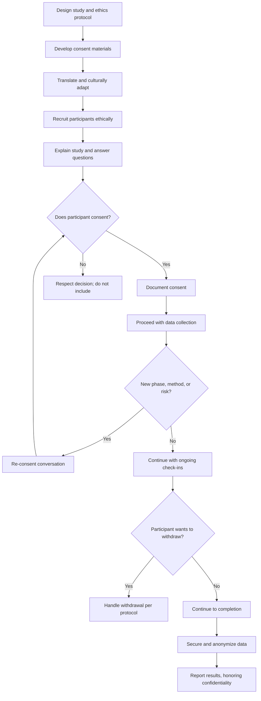

# Consent Templates and Examples

Practical templates, sample wording, checklists, and flowcharts for creating
informed consent documents in qualitative anthropological research.

---

## Consent Form Template (Written/Signed)

Adapt each section to your study context, institutional requirements, and
participant population.

### 1. Title and Identification

| Field | Entry |
|---|---|
| **Study Title** | [Full descriptive title in plain language] |
| **Principal Investigator** | [Name, title, department] |
| **Co-Investigators** | [Names and roles, if applicable] |
| **Institution** | [University or organization name] |
| **IRB/Ethics Protocol Number** | [Assigned protocol ID] |
| **Version and Date** | [e.g., Version 2.1 -- January 15, 2025] |
| **Funding Source** | [Grant or sponsor, if applicable] |

### 2. Key Information Summary

> **What you should know before deciding:**
>
> - This study explores [topic in one sentence].
> - If you take part, you will [brief description of what participation involves].
> - Participation will take approximately [duration].
> - The main risks are [list primary risks in plain terms].
> - We will protect your privacy by [primary safeguard].
> - Your participation is entirely voluntary. You may stop at any time without penalty.

*Guidance: The revised Common Rule (2018) requires that consent begin with a
concise presentation of key information to help a reasonable person decide
whether to participate.*

### 3. Purpose of Study

Describe the study goal in two to four sentences of plain language. Avoid
jargon. State what you hope to learn and why it matters.

> Example: "This study seeks to understand how families in [community] make
> decisions about healthcare. By learning about your experiences, we hope to
> improve the way health services are offered in this region."

### 4. Procedures

Describe what participation involves -- activities, duration per session, number
of sessions, location, and whether recording will be used.

> Example: "If you agree, I will conduct one interview lasting 60 to 90 minutes
> at a location of your choice. With your permission, I will audio-record the
> interview. You may also be asked to participate in a follow-up of about 30
> minutes."

### 5. Voluntary Participation

State clearly that participation is entirely voluntary, there is no penalty for
refusing or withdrawing, the participant may skip any question, the participant
may stop at any time, and declining will not affect services, employment,
grades, or relationships.

### 6. Risks and Benefits

- **Risks**: Describe potential discomforts honestly (emotional discomfort, fatigue, residual identification risk).
- **Benefits**: State direct benefits (often none) and indirect benefits (knowledge, policy improvements).
- **Compensation**: State any compensation and clarify it does not obligate continued participation.

### 7. Confidentiality and Data Handling

Describe how information will be recorded, stored (password-protected devices,
encryption), who has access, how participants will be anonymized (pseudonyms),
retention and destruction timelines, and any limits of confidentiality
(mandatory reporting obligations).

### 8. Use of Audio/Visual Recording

Provide tiered permission options (see Tiered Media Consent Template below).
Describe what will be recorded, how recordings will be used, who will have
access, when they will be destroyed, and that participation is possible without
being recorded.

### 9. Future Use and Data Sharing

State whether anonymized data may be shared or deposited in a repository,
describe what "anonymized" means in practice, affirm the right to refuse future
use, and note any international data sharing.

### 10. Withdrawal

Reiterate the right to withdraw. Explain how to withdraw, what happens to data
already collected, and any limits (e.g., published data cannot be retracted).

### 11. Consent Statement

> I have read this form (or had it read to me). I understand the information
> above. I have had the opportunity to ask questions and have received
> satisfactory answers. I voluntarily agree to participate in this study.
>
> Participant Name (print): \_\_\_\_\_\_\_\_\_\_\_\_\_\_\_\_\_\_\_\_\_\_\_\_
>
> Participant Signature: \_\_\_\_\_\_\_\_\_\_\_\_\_\_\_\_\_\_\_\_\_\_ Date: \_\_\_\_\_\_\_\_\_\_
>
> Researcher Signature: \_\_\_\_\_\_\_\_\_\_\_\_\_\_\_\_\_\_\_\_\_\_\_ Date: \_\_\_\_\_\_\_\_\_\_

*For verbal consent, replace the signature block with a researcher attestation.*

### 12. Contacts and Questions

| Role | Name | Contact |
|---|---|---|
| Principal Investigator | [Name] | [Email, phone] |
| Faculty Advisor (if student) | [Name] | [Email, phone] |
| IRB/Ethics Board | [Office name] | [Email, phone, address] |

---

## Information Sheet Template (Verbal Consent / Waiver of Documentation)

Use when a signed form is waived (minimal risk, contexts where signatures
create risk, or where written consent is culturally inappropriate). Contains the
same essential content as the consent form but is framed as a document the
participant keeps.

**Key differences from the signed form:** no signature line; headed as
"Information Sheet"; shorter (one to two pages); more visual with bullet points;
accompanied by a separate oral consent script; includes: "By agreeing to
participate, you show that you understand this information and consent
voluntarily."

**Recommended structure:** (1) Study title and researcher ID, (2) What the
study is about, (3) What you will be asked to do, (4) Voluntary nature,
(5) Risks and benefits, (6) How information will be protected, (7) Contact
information.

---

## Oral Consent Script Template

A structured script for verbally obtaining and documenting consent, used in
conjunction with the Information Sheet.

**Introduction:**
> "Hello, my name is [Name]. I am a researcher from [Institution]. I would like
> to tell you about a study I am conducting and ask if you would be willing to
> participate."

**Walk-through of required elements** (conversational language):
> "This study is about [topic]. I am trying to learn [purpose]. If you agree, I
> would like to [procedures]. This will take about [time]. You do not have to
> take part. If you start and change your mind, you can stop at any time. There
> is no penalty. I will keep your answers private and use a different name for
> you in my notes and reports."

**Check understanding:** Pause and ask: "Do you have any questions about what I
have described?" and "Is there anything you would like me to explain again?"

**Ask for agreement:** "Do you agree to participate in this study?" If
recording: "Do you also agree to have this conversation recorded?"

**Witness protocol:** If required by the IRB, a witness observes the consent
conversation and signs a separate attestation form.

**Documentation:** The researcher records in field notes: date/time, participant
identifier, confirmation that verbal consent was given, witness name (if
applicable), and any conditions the participant placed on their consent.

---

## Sample Consent Wording (Plain Language)

Modular text blocks for insertion into any consent document. Multiple options
provided for different registers and contexts.

### Introduction

- **Formal:** "You are invited to take part in a research study about [topic]. This study is being conducted by [Name], a researcher at [Institution]."
- **Conversational:** "I am doing a study to learn about [topic]. I would like to invite you to share your thoughts and experiences with me."
- **Community-oriented:** "Together with [community organization], we are trying to learn more about [topic]. We are asking people in this community if they would be willing to share their views."

### Procedures

- **Option A:** "If you agree, I will ask you questions about [topic]. The conversation will take about [time]. With your permission, I would like to record the audio so I can listen carefully later."
- **Option B:** "Participation involves a single interview of approximately [time] at a place convenient for you. I will take handwritten notes during our conversation."

### Voluntariness

> "Your participation is entirely voluntary. You may refuse to answer any
> question or stop at any time. This will not affect [your services / your
> relationship with the organization / your standing] in any way."

### Risks and Benefits

- **Minimal risk:** "There are no known risks beyond those of normal conversation. You might feel tired or emotional; you are free to take breaks or stop at any time."
- **Indirect benefit:** "You will not be paid for participating. Your input will contribute to understanding [topic], which may help improve [services/policies]."

### Confidentiality

- **Standard:** "I will keep your answers private. I will use a fake name in my notes and reports. Your real name will not appear in any publication. All data will be stored on a password-protected, encrypted computer."
- **Honest limitation:** "Despite these precautions, we cannot guarantee that your identity will never be discoverable, especially in a small community where details of your story may be recognizable."

### Recording Consent

> "With your permission, this interview will be audio-recorded so I can focus on
> our conversation. After I type the transcript, the recording will be deleted.
> Only [researcher / the research team] will listen to it. You can participate
> even if you prefer not to be recorded."

### Data Use

> "The results may be published in academic journals and presented at
> conferences. No identifying information will be included."

---

## Tiered Media Consent Template

A separate consent section allowing participants to grant or withhold permission
for specific types of recording and use. Each option is independent.

> **Media and Recording Permissions**
>
> Check the boxes that apply. You may agree to some and decline others.
> Declining any option will not affect your participation.
>
> - [ ] I agree to be **audio-recorded** during this interview.
>   *The recording will be transcribed and then deleted.*
> - [ ] I agree to be **video-recorded** during this research activity.
>   *Video will be used for analysis only and not shared publicly without separate permission.*
> - [ ] I agree to be **photographed** during this research activity.
>   *Photographs will be used for [specify purpose].*
> - [ ] I agree that **anonymized quotes** from my interview may be used in publications.
>   *A pseudonym will be used in place of your name.*
> - [ ] I agree that **images of me** may be used in:
>   - [ ] Academic publications and presentations only
>   - [ ] Public media (websites, exhibitions, reports)
>
> Participant Initials: \_\_\_\_\_\_\_\_\_\_ Date: \_\_\_\_\_\_\_\_\_\_

---

## Consent for Focus Groups

Include the following additional language for group discussions:

> "Because this is a group discussion, your identity will be known to other
> participants. We cannot guarantee that other participants will keep what is
> said confidential. We will ask everyone to respect confidentiality, but you
> should consider this when deciding what you feel comfortable sharing."

**Ground rules to present at the start of each session:**

1. What is said in the group stays in the group.
2. Speak one at a time.
3. Respect differing opinions.
4. You may choose not to answer any question.
5. The facilitator may move the conversation along to respect everyone's time.

---

## Consent for Participant Observation

Participant observation requires a layered approach because the researcher
interacts with many people in varied and evolving ways.

| Layer | Description | Documentation |
|---|---|---|
| **Site-level permission** | Formal authorization from organization or community governing body | Written agreement or letter of support |
| **Researcher introduction** | Script explaining who you are and what you are doing, delivered to the broader group | Oral announcement; written notice posted |
| **Primary participant consent** | Full individual consent for key informants | Signed form or documented verbal consent |
| **Incidental contacts** | People observed in passing in public settings | No identifiable information recorded |
| **Ongoing check-ins** | Periodic re-affirmation with primary participants as the study evolves | Noted in field journal with date |

**Researcher introduction script example:**
> "I am [Name], a researcher from [Institution]. I am spending time in this
> [setting] to learn about [topic]. I may take notes, but I will not use
> anyone's real name. If you have questions or do not want to be included,
> please let me know at any time."

---

## Consent for Longitudinal Research

**Initial consent should include:** explanation that the study involves multiple
contacts over [timeframe], an outline of expected activities at each stage, and
the statement: "You will be asked at each follow-up whether you still wish to
participate."

**Re-consent protocol** (at each new contact): (1) Remind participant of the
study purpose, (2) Summarize what has happened so far, (3) Describe what this
session involves, (4) Ask whether they still wish to continue, (5) Document
re-affirmation in field records.

**Re-consent is required when:** new methods are introduced, new topics arise
not covered in original consent, the risk profile changes, data sharing or
publication plans change, or research team access to identifiable data changes.

**Re-consent is not required for:** routine follow-up within approved scope,
minor scheduling adjustments, or continuation of the same protocol.

---

## Consent for Multi-Site and International Research

| Issue | Guidance |
|---|---|
| **Multiple IRB approvals** | Each site typically requires its own ethics review before data collection begins. |
| **Version management** | Maintain a master template with a version log. Track site-specific adaptations by version number and date. |
| **Translation** | Use professional forward-and-back translation. Have documents reviewed by local collaborators. |
| **International data transfer** | Notify participants if data will cross national borders. Name the countries involved. |
| **GDPR (EU participants)** | Consent must be freely given, specific, informed, and unambiguous. Include rights to access, rectify, and erase personal data. |
| **Harmonization** | Use the most protective standard across all sites as the baseline. Add site-specific provisions where local requirements exceed it. |

---

## Consent Checklist

**Required elements:**

- [ ] Study purpose clearly stated in plain language
- [ ] Sponsor or funder identified
- [ ] Procedures described (what, where, when, how long)
- [ ] Voluntary nature of participation stated
- [ ] Right to withdraw without penalty stated
- [ ] Right to skip questions stated
- [ ] Risks and discomforts described honestly
- [ ] Benefits described (or stated as none)
- [ ] Compensation described (or stated as none)
- [ ] Confidentiality measures explained (pseudonyms, data security)
- [ ] Limits of confidentiality acknowledged
- [ ] Data storage, retention, and destruction plan described
- [ ] Consent for audio recording (separate, tiered)
- [ ] Consent for video recording (separate, tiered, if applicable)
- [ ] Consent for photography (separate, tiered, if applicable)
- [ ] Consent for use of quotes in publications
- [ ] Contact information for researcher provided
- [ ] Contact information for IRB or ethics board provided

**Recommended additional elements:**

- [ ] Special provisions for minors or vulnerable populations
- [ ] Translation reviewed for accuracy and cultural fit
- [ ] Community-level authorization documented
- [ ] Ongoing consent process described in protocol
- [ ] Data sharing plan matches consent language
- [ ] Future use of data addressed
- [ ] Document retention plan specified
- [ ] Version number and date on every page
- [ ] Institution logo and IRB protocol number included

---

## Consent Process Flowchart

---

## Consent Document Formatting Guidelines

| Element | Recommendation |
|---|---|
| **Font size** | 12-point minimum; 14-point for older adults or low-literacy populations |
| **Font family** | Sans-serif (e.g., Arial, Calibri, Helvetica) for readability |
| **Margins** | Standard one-inch (2.54 cm) on all sides |
| **Section headings** | Bold, clearly labeled, with adequate spacing |
| **Paragraph style** | Bullet points and short sentences; avoid dense paragraphs |
| **Length** | 2--4 pages for consent form; 1--2 pages for information sheet |
| **Reading level** | Sixth- to eighth-grade level; use readability tools to check |
| **Version control** | Version number and date in footer of every page |
| **Identifiers** | Institution logo and IRB protocol number where required |

**Additional tips:** Avoid all-caps text. Use line spacing of 1.15 to 1.5.
Number pages (e.g., "Page 1 of 3"). If printing double-sided, avoid splitting
sections across pages. For low-literacy contexts, supplement with visual aids or
pictorial consent tools.
