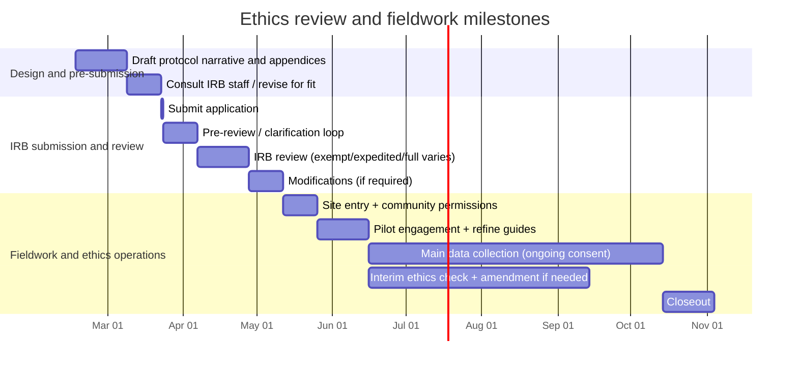

# IRB Protocol Guide

Regulatory foundations, protocol template with section-by-section guidance,
dual applicant-reviewer checklist, comparative guidance across major sources,
key tensions, and practical tips for writing IRB and ethics protocols for
qualitative anthropological research.

## Regulatory and Professional Foundations

### The Common Rule (45 CFR 46)

The baseline U.S. ethical framework remains the Belmont Report's triad:
respect for persons, beneficence, and justice. In IRB practice, those
principles are operationalized through the Common Rule's criteria for
approval, which require (among other things) risk minimization, risk-benefit
reasonableness, equitable selection, informed consent, and "adequate
provisions" for privacy and confidentiality when appropriate.

Two consent details are especially salient for qualitative protocols:

1. **Key information requirement.** The revised Common Rule requires that
   informed consent begin with "key information" presented in a way that
   facilitates comprehension. Many universities now standardize consent
   layouts that start with a concise summary.

2. **Waiver of documentation.** Qualitative fieldwork often justifies a
   waiver of documentation (signed forms) while still conducting a robust
   consent process. This is framed as "verbal consent with waiver of
   documentation," compatible with the rule's separation of the consent
   process from documentation when criteria are met.

### American Anthropological Association Ethics

The AAA's ethics guidance is frequently treated as discipline-specific
interpretive scaffolding for IRBs. Key principles:
- "Do no harm"
- Consent may be ongoing and contextually negotiated, not only a one-time
  signature
- Researchers have durable responsibilities to protect and preserve records
- Competing obligations (to participants, communities, discipline, public)
  must be weighed

### Ethnography-Specific IRB Guidance

The Harvard Catalyst ethnography guidance (for both researchers and
reviewers) normalizes bounded uncertainty in ethnography:
- Distinguishes primary from incidental subjects
- Endorses estimated sample sizes
- Emphasizes culturally appropriate consent approaches
- Legitimizes ethnographic flexibility and layered consent

### International and Indigenous Frameworks

These add obligations beyond most U.S. IRB forms:

- **TCPS 2 Chapter 9 (Canada):** Frames "engagement with community" as
  integral to ethical research involving Indigenous Peoples. Addresses
  balancing individual and collective interests.
- **CARE Principles:** Collective benefit, authority to control, responsibility,
  ethics. Assert collective rights and authority to control Indigenous data.
- **OCAP Principles:** Ownership, control, access, possession. Apply to
  research involving First Nations in Canada.
- **FPIC (Free, Prior, and Informed Consent):** Community-level authorization
  as a distinct ethical layer that does not replace individual consent but
  conditions legitimate access and use.

---

## Protocol Template with Section-by-Section Guidance

The template below is designed to be "IRB-readable" while respecting
ethnographic realities. Word counts are pragmatic targets for a stand-alone
protocol narrative (excluding appendices). Adjust if your institution uses a
SmartForm-style application where content is distributed across fields.

| Section | Purpose to a reviewer | What to include | Suggested words |
|---|---|---|---|
| Project overview and "key information" | Rapid orientation; reduces back-and-forth | Research purpose; who/where; methods; recordings; main risks; main safeguards; voluntariness | 150-250 |
| Research questions and analytic goals | Establishes "systematic investigation" and social value | Primary questions; how theory/constructs map to methods; boundaries of inquiry | 250-450 |
| Setting and sites | Determines privacy expectations and permissions | Sites; public vs private spaces; whether gatekeepers exist; site permission plan | 250-450 |
| Study population | Equitable selection; vulnerability flags | Inclusion/exclusion; estimated numbers; "primary vs incidental" participants; anticipated demographics relevant to risk | 250-450 |
| Recruitment and access | Evaluates coercion risk and undue influence | Entry strategy; gatekeeper role; scripts; incentives; non-response handling; snowball sampling boundaries | 450-800 |
| Methods and procedures | Core risk assessment anchor | Participant observation; interview/focus group/oral history guides; recording plan; duration; locations; remote vs in-person | 800-1,300 |
| Consent processes | Meets consent requirements; addresses ethnographic consent realities | Written vs verbal vs layered consent; ongoing consent checkpoints; consent for recordings; withdrawal logistics | 700-1,200 |
| Confidentiality and anonymization | Addresses deductive disclosure and group limits | Pseudonyms; deductive disclosure risk; focus group limits; handling quotes; identification vs recognition option | 600-1,000 |
| Data management and security | "Protect and preserve records" translated into controls | Storage locations; encryption for portable devices; access control; key-file separation; retention; destruction; sharing/archiving | 800-1,300 |
| Risks and mitigation | Satisfies risk minimization; shows competence | Social/legal/reputational risk; emotional distress; community harms; researcher safety; mitigation steps; referral resources | 600-1,100 |
| Benefits, reciprocity, dissemination | Clarifies benefits beyond clinical framing | Direct benefits (often none); community benefit; reciprocity plan; results-sharing; accessibility | 300-600 |
| Vulnerable populations and power dynamics | Adds safeguards "when appropriate" | Diminished autonomy; minors; dependency relations; gatekeeper power; mitigation (separation from services, consent supports) | 400-800 |
| Fieldwork contingencies and amendment plan | Makes uncertainty governable | Triggers for modifications; safety pivots; remote substitutions; re-consent for new uses; adverse event reporting pathway | 350-700 |

**Expected appendices:** Recruitment scripts/materials; consent form or
information sheet; oral consent script; interview/focus group guides;
observation protocol; de-identification rules; data management plan
(expanded); referral list; site permission letters.

---

## Dual Applicant-Reviewer Checklist

This checklist functions both as a pre-submission QA tool and as a
reviewer-oriented map of decision points.

| Domain | Applicant has... | Reviewer can verify... |
|---|---|---|
| Research determination | Stated whether this is human subjects research, and why | Definitions are applied consistently to planned interactions and identifiable data |
| Level of review | Identified likely exempt/expedited/full-board pathway; noted uncertainties | Claimed pathway matches methods, identifiability, and risk profile |
| Research questions | Clear questions tied to methods and outputs | Goals show "social value" and interpretive coherence |
| Sites and permissions | Clarified public vs private spaces; identified gatekeepers; included permission letters as needed | Site permission and privacy expectations are plausible for the setting |
| Population | Defined primary participants; handled incidental persons; justified estimated sample size range | Sample size logic is consistent with field scale and recording practices |
| Recruitment | Provided scripts; explained gatekeeper role; minimized coercion; avoided conflating research with services | Recruitment pathways avoid undue influence and role confusion |
| Consent approach | Specified written vs verbal; included "key information"; addressed documentation waiver if used | Consent process meets required elements; documentation waiver is justified if requested |
| Ongoing consent | Defined consent as iterative (checkpoints, re-consent triggers) | Ongoing consent plan is operational, not aspirational |
| Recordings | Specified audio/video/photo plans; separate consent for recordings; storage and destruction | Identifiability of voice/face is treated as a privacy and confidentiality issue |
| Focus group limits | Stated confidentiality cannot be guaranteed; set group ground rules | Consent language acknowledges group disclosure risk |
| Anonymization | Addressed deductive disclosure; described quote handling; set de-identification rules | Anonymization plan is realistic for small-N, high-context data |
| Data security | Described storage, encryption for portable devices, access controls, key-file separation | Safeguards align with institutional guidance and sensitivity level |
| Data sharing/archiving | Stated whether and how data may be shared; consent language matches plan; access controls considered | Sharing claims do not exceed what the consent process can support |
| Legal risk | Considered subpoenas/compelled disclosure; considered Certificates of Confidentiality when appropriate | Legal risk framing matches topic and identifiability; protections are not overstated |
| Risks to participants | Identified plausible harms (social, reputational, legal, emotional); mitigation and referrals | Risks are minimized and proportionate to knowledge value |
| Community impacts | Considered community-level harms and benefits; planned results sharing | Collective dimensions are not ignored where salient |
| Vulnerable populations | Identified vulnerabilities (children, prisoners, dependency, trauma context) and safeguards | Additional protections are included when appropriate |
| Reciprocity and compensation | Justified incentives and reciprocity practices; avoided undue influence | Payments and reciprocity do not undermine voluntariness |
| Fieldwork contingencies | Listed triggers for amendments, safety pivots, and re-consent | Protocol anticipates emergent changes without becoming noncompliant |

---

## Comparative Analysis Across Major Guidance Sources

| Source | What it strongly standardizes | Qualitative strengths | Common gaps a fieldworker must fill |
|---|---|---|---|
| Harvard Catalyst ethnography guidance (2024) | Case-by-case IRB applicability; site permission; public vs private observation; estimated sample size; primary vs incidental subjects; rationale for verbal consent | Explicitly legitimizes ethnographic flexibility and layered consent; practical language for reviewers and researchers | Does not substitute for institution-specific forms; limited space on power dynamics and reciprocity beyond consent framing |
| UCLA SBER protocol template (2025) | Detailed, sectioned protocol narrative; explicit data security and privacy/confidentiality subsections; recruitment and consent documentation | Provides a comprehensive "fill-in-the-blank" structure that matches reviewer checklists | Less tailored to emergent ethnography; power dynamics/community consent are not core fields and must be argued explicitly |
| University of Michigan IRB guidance | Clear operational expectations: encryption, access limitation, separation of identifiers/keys; definitional clarity on privacy vs confidentiality | Highly actionable security controls; helps translate "protect records" into auditable steps | Primarily procedural and institution-specific; does not address community governance, reciprocity, or digital quoting risks |
| University of Washington ethics guidance | Exemption category guidance (including interviews and public behavior) and Belmont-based ethical framing | Useful for scoping review level and articulating respect/beneficence/justice in plain language | Individual-centered; community consent and Indigenous governance require supplementation |
| American Anthropological Association ethics (2012) | Principles: do no harm; openness; informed consent; competing obligations; accessibility; record protection | Directly addresses ongoing consent as dialogue; foregrounds competing obligations and record stewardship | Not a regulatory manual; must be mapped to Common Rule categories and institutional requirements |
| CIOMS international guidelines (2016) | Internationally vetted ethical principles; detailed guidance on consent, vulnerability, social value, and review structures | Strong articulation of social value, vulnerability, and fairness; useful for international field sites | Health-related research orientation; collective rights and Indigenous sovereignty are not its center of gravity |

---

## Key Tensions and Debates

### Ongoing Consent vs the Consent Form

The field continues to debate whether informed consent should be
conceptualized as a discrete act (signature) or as continuous relational
practice. Ethnographic guidance recommends ongoing consent, especially as
relationships and contexts change. The practical bridge: explicitly
distinguish "consent process" (ongoing, relational) from "documentation"
(the form), and propose verbal consent scripts plus information sheets
where written signatures would increase risk or distort the relationship.

### Anonymity vs Recognition

In oral history and some community-engaged anthropology, anonymity can be
experienced as erasure, while public attribution can introduce long-term
risk. Protocols increasingly adopt "participant choice" models (pseudonym
vs attribution) paired with dissemination choices and time-limited
restrictions.

### Open Science vs Confidentiality and Sovereignty

Qualitative data sharing infrastructures have matured, but no consensus
exists on what "responsible sharing" means for high-context ethnographic
materials. The contemporary compromise is selective sharing (materials,
codebooks, de-identified transcripts) plus controlled access, with explicit
consent language and governance review. Indigenous data sovereignty
frameworks add further constraints that may properly limit sharing
irrespective of de-identification.

### Unit of Ethical Concern: Individual vs Collective

U.S. IRB review is structurally oriented toward individual subjects.
Indigenous research ethics frameworks elevate collective interests, community
governance, and culturally grounded protocols as integral to ethical
legitimacy. Protocols should make these governance choices explicit so that
dissemination, archiving, and sharing are consent-consistent and
community-consistent from the start.

---

## Practical Tips for Improving Review Outcomes

Three tactics are consistently effective:

**1. Map ethnographic uncertainty to compliance mechanisms.**
Estimated sample sizes plus an amendment plan; a priori interview domains
plus room for follow-ups; contingency plan for fieldwork changes. Estimating
sample size conservatively and amending later is recommended because
over-enrollment without amendment can constitute noncompliance.

**2. Operationalize confidentiality and data security with concrete
safeguards.**
Reviewers respond better to "how exactly" than to "we will keep data
secure." Specify encryption for portable devices, separation of identifiers
from data and keys, named storage locations, and access control roles.

**3. Anticipate the two most common qualitative reviewer objections.**
- "How will you obtain consent in messy real life?" — Address with layered
  and ongoing consent.
- "How can you promise confidentiality when the data are contextual?" —
  Address with a deductive disclosure plan and, where relevant, controlled
  access sharing.

---

## Ethics Review and Fieldwork Milestones (Illustrative Timeline)

---

## Primary Sources and Regulatory References

- Common Rule regulations (45 CFR 46): OHRP regulations index
- 45 CFR 46.116 (consent requirements): Cornell LII
- Belmont Report: OHRP
- American Anthropological Association ethics (2012)
- Harvard Catalyst ethnography guidance for researchers and reviewers (2024)
- UCLA SBER protocol template (2025)
- University of Michigan IRB application tips and data security guidance
- AoIR Internet Research Ethics 3.0
- TCPS 2 Chapter 9 (Canada): research involving Indigenous Peoples
- CARE Principles for Indigenous Data Governance (Carroll et al., 2020)
- CIOMS International Ethical Guidelines (2016)
- Oral History Association principles and best practices
