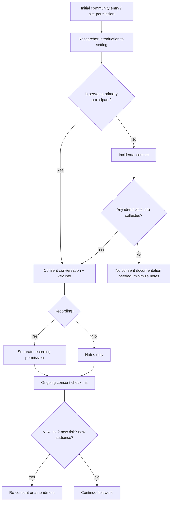
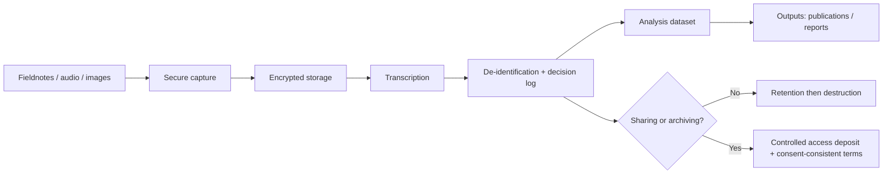

# IRB Templates and Examples

Method-specific guidance, consent form templates, recruitment scripts, data
management plan template, risk mitigation strategies, and annotated protocol
excerpts for qualitative anthropological research.

## Method-Specific Guidance

### Participant Observation

Best-practice protocols treat participant observation as a bundle of
interactions rather than a single "procedure," then separate "primary
subjects" (people you shadow or systematically interview) from incidental
contacts. This framing reduces reviewer anxiety about undefined participant
sets.

**Consent strategies are typically layered:**
1. Site-level permission process (organizational or community authorization)
2. Researcher introduction script for the broader milieu
3. Individualized consent for primary participants and for any recording

**In public spaces:** Protocols should justify why observation does not
require individual consent, emphasizing non-identifiability and low
reputational/legal risk if disclosure occurred.

**Privacy risks:** Small communities, distinctive roles, and narrative detail
can make "de-identified" data re-identifiable. Plan explicitly for deductive
disclosure: aggregating place names, using role-based descriptors, and using
controlled access when archiving.

### Interviews

Strong interview protocols specify:
- Interview setting, duration, and mode (in-person, phone, video)
- Recording plans and transcription workflows
- Whether identifiers are collected
- "Flexibility boundaries": what can change without amendment (follow-up
  questions, emergent themes) vs what requires amendment (new populations,
  new recording types, materially increased risk)

**Verbal consent:** If written consent is risky or culturally inappropriate,
protocols can justify oral consent with waiver of documentation while still
providing participants a written information sheet. This is consistent with
the Common Rule's separation of the consent process from documentation.

### Focus Groups

Protocols must state plainly that **confidentiality cannot be guaranteed**
because other participants hear what is said.

**Mitigation is procedural:**
- Limit group size
- Avoid collecting direct identifiers during group sessions
- Set ground rules at the start
- Allow participants to decline questions
- Consider whether sensitive topics are more appropriate for interviews

Reviewer confidence increases when protocols treat group confidentiality as a
managed limitation rather than a promise.

### Oral Histories

Oral history ethics often invert typical IRB defaults:
- Many narrators prefer attribution over anonymity
- Archiving and public access are frequently goals rather than risks
- Narrators may reasonably expect review and control over downstream uses

**Protocols that propose archiving should specify:**
- Where materials will be deposited
- What access conditions will apply
- Whether narrators can review transcripts
- How restrictions or embargoes will be handled

**Research determination:** A recurring ambiguity is whether a project is
"oral history activity" outside the regulatory definition of research. The
determination depends on whether the activity is designed to contribute to
generalizable knowledge. Many institutions still require IRB consultation
even when oral history is argued to fall outside oversight. State your
determination and your institution's expected pathway.

### Visual Methods

Visual methods collapse the distance between "data" and identity. Protocols
should assume that faces, distinctive locations, and voiceprints make
re-identification plausible.

**Include explicit choices:**
- (a) Anonymize images (blurring, cropping, re-photographing)
- (b) Use images for analysis only and not dissemination
- (c) Use identifiable images with explicit, voluntary permission for
  specific dissemination contexts

**Participant-generated media** (photo elicitation, participatory video):
Protocols also need a rights and ownership plan and a dissemination
governance plan. Copyright and ownership are ethical dimensions, not
mere legal afterthoughts.

### Digital Ethnography

Digital ethnography raises issues that IRB forms do not natively capture:
blurred public-private boundaries, platform governance, participant
expectations, trace data persistence, and harms that arise at community
scale rather than at the level of individual subjects.

The Association of Internet Researchers (AoIR) guidance frames internet
research ethics as context-specific and question-driven rather than
rule-deductive — a useful meta-justification when explaining why a single
consent mechanism is insufficient.

**Protocols should specify:**
- Quoting and paraphrase rules (verbatim quotes can become searchable
  identifiers)
- Screenshot handling
- Data minimization
- Whether participants will be notified in contexts where direct consent
  is infeasible or unsafe

---

## Consent Form Templates and Sample Language

These are modular text blocks designed for insertion into formal consent
forms, one-page information sheets, or oral consent scripts. Edit to reflect
your actual study and your institution's required language.

### Key Information (Top of Consent Form)

- You are being asked to take part in a research study about: [topic].
- What you will do: [interview/observation/focus group], lasting about
  [duration].
- Audio/video/photos: [yes/no; if yes, describe].
- Main risks: [brief, concrete].
- Privacy: we will [core safeguards], but we cannot promise absolute
  confidentiality.
- Your choice: participation is voluntary; you may skip questions and stop
  at any time.

This structure aligns with the Common Rule's "key information" requirement
and with university template trends.

### Ongoing Consent Language (Ethnography-Forward)

"Consent is an ongoing conversation. I will check in with you over time about
whether you still want to participate, especially if the study focus shifts,
if we move to a new setting, or if I would like to use a quotation or image
in a public way."

### Verbal Consent with Waiver of Documentation

"I will ask for your verbal consent rather than asking you to sign a form. If
you agree, I will give you a written information sheet to keep. You can still
choose not to participate, or to stop later, even if you initially agree."

This approach fits the distinction between the consent process and
documentation, commonly used when signatures increase risk.

### Focus Group Confidentiality Limit

"Because this is a group discussion, your identity will be known to other
participants. The research team cannot guarantee that other participants will
keep what is said confidential. We will ask everyone to respect
confidentiality, but you should decide what you feel comfortable sharing."

### Audio/Video/Visual Recording Consent (Tiered)

"You can participate even if you do not agree to be audio-recorded. If you
do not want recording, I will take written notes instead."

Only use if true. Also specify retention and destruction choices, because
recordings are widely treated as identifiable.

### Certificate of Confidentiality Statement

If your study is NIH-funded or otherwise covered, describe the protections
and exceptions accurately, avoiding overpromising. Disclosure of identifiable,
sensitive research information is prohibited except in limited circumstances
(when required by law, with participant consent, or for other compliant
research).

---

## Recruitment Script Template

A minimal, IRB-friendly recruitment script includes: who you are, why you are
contacting them, what participation involves, voluntariness, and how to
decline.

**Sample:**
"Hello, my name is [name]. I am a [role] at [institution]. I am doing a
research study about [topic]. I am inviting people who [eligibility
description] to participate in a [interview/focus group] that takes about
[duration]. Participation is voluntary, and saying no will not affect
[services/employment/relationship] in any way. If you are interested, I can
describe the study and answer questions; if not, that is completely fine."

---

## Data Management Plan Template

A state-of-the-art qualitative DMP is specific enough to be auditable.

### Core DMP Headings

**Data types:** Fieldnotes, transcripts, audio/video, images, artifacts,
metadata.

**Identifiers:** What is collected, what is avoided, what is needed
operationally.

**Storage:** Institution-managed secure storage; encrypted drives for
fieldwork; no sensitive data in personal cloud services unless approved.

**Access control:** Least-privilege; named roles; audit trail if available.

**De-identification rules:** Direct identifiers removed; indirect identifiers
generalized; a decision log for substitutions.

**Retention and destruction:** Timeline and method; separate handling for
consent forms vs data.

**Sharing/archiving:** What is shared (often transcripts and codebooks rather
than audio/video), under what controls.

---

## Risk Mitigation Menu

### Deductive Disclosure (Small Communities, Distinctive Roles)

- Aggregation of place names and organizational identifiers
- Temporal fuzzing (shifting dates by consistent offset)
- Role-based descriptors instead of specific titles
- Controlled access archiving
- Explicit consent about identifiability limits

### Emotional Distress

- Distress protocol (pause, skip, stop)
- Referral information prepared in advance
- Clear boundary between research and counseling
- Debriefing procedures for sensitive topics

### Legal/Social Risk

- Data minimization: avoid collecting unnecessary identifiers
- Consider Certificates of Confidentiality where appropriate
- Avoid overpromising protections
- Assess subpoena/compelled disclosure risk for the topic

### Community Harm and Power Dynamics

- Community engagement plan
- Reciprocity commitments
- Governance of dissemination (community review before publication)
- Avoid reinforcing gatekeeper coercion
- Separate research from services or employment evaluation

### Cross-Border Data Exposure

- Explicit plan for device security during travel
- Border search contingency (what data is on the device?)
- Data transfer protocols between jurisdictions
- Awareness of local data protection regulations

---

## Annotated Protocol Excerpts

These excerpts are synthetic, redacted examples demonstrating structure and
tone. They do not represent any real application.

### Excerpt A: Participant Observation with Layered Consent

**Setting and participants.** Fieldwork will occur at [COMMUNITY
ORGANIZATION] and adjacent public spaces (sidewalks, parks). Primary
participants are individuals who consent to be shadowed during routine
activities and who participate in at least one recorded interview (estimated
n = 25-35). Incidental individuals may be encountered during observation; no
identifiable information about incidental individuals will be recorded.

**Consent.** I will obtain written consent from primary participants prior to
any audio recording. For observation-only interactions, I will use an
information sheet and verbal consent check-ins. Consent will be revisited
monthly and whenever the research focus shifts or dissemination plans change.

**Flexibility and amendments.** Ethnographic sampling is iterative; if the
study expands to new sites or includes a materially different population, I
will submit an amendment before proceeding.

**Why this works:** Distinguishes primary vs incidental subjects, treats
sample size as estimate, and frames consent as continuing. This reduces
reviewer concerns about unpredictability.

### Excerpt B: Digital Ethnography with Quote-Searchability Mitigation

**Data sources.** Data include posts and comment threads from [PLATFORM]
communities focusing on [TOPIC]. Although content may be publicly accessible,
I will treat participants as human subjects when I collect, curate, and
analyze identifiable content.

**Quoting policy.** I will not publish verbatim excerpts that are likely to
be searchable. Instead, I will paraphrase and remove unique phrases, and I
will avoid screenshots containing usernames. When verbatim quotation is
analytically necessary, I will seek direct permission from the poster when
feasible and safe; otherwise I will use paraphrase plus contextual
description.

**Data security.** Raw captures will be stored in an encrypted container; a
separate key-file linking pseudonyms to handles will be stored separately
with restricted access.

**Why this works:** Operationalizes context-sensitive internet research ethics
and addresses the risk that digital quotations can function as searchable
identifiers.

### Excerpt C: Oral History with Participant Control and Archiving

**Purpose and outputs.** This project documents lived experiences of
[HISTORICAL EVENT / SOCIAL CHANGE]. Narrators may choose whether they wish
to be credited by name or identified by a pseudonym.

**Review and access.** Narrators will be offered the opportunity to review
the transcript for accuracy and to flag segments they prefer to restrict for
a defined period (for example, 5 years).

**Archiving.** With narrator permission, recordings and transcripts will be
deposited at [ARCHIVE] under the access conditions selected by the narrator
(open, restricted, or embargoed).

**Why this works:** Reflects oral history best practices emphasizing informed
consent, clarity about future uses, and avoiding promises that cannot be kept.
Treats archiving as a planned feature rather than a confidentiality failure.

---

## Mermaid Workflows

### Consent Process Flow for Ethnographic Research

### Data Lifecycle Flow

