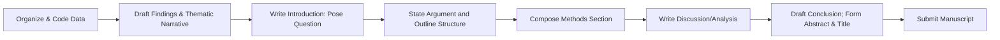

# Article Architecture Guide

Section-by-section guidance for writing anthropology research articles and thesis/dissertation chapters. This reference covers the full arc from initial drafting through manuscript submission, with structural templates, word count norms, and a comprehensive checklist.

---

## The Writing Process Flow

Writing a research article is rarely a linear process. Most experienced writers draft sections out of order, beginning with the material they know best and building outward. The following flowchart represents a common and effective sequence for moving from organized data to a finished manuscript.

### Why Start with Findings?

Many writers find it productive to draft the findings section first. This is the section closest to your data, where you have the most concrete material to work with. Drafting findings early accomplishes several things:

- It forces you to identify your strongest evidence and most compelling themes before you commit to a framing argument.
- It reveals the actual shape of your contribution, which may differ from what you initially imagined.
- It provides a foundation for the introduction, since you can now write an opening that accurately sets up what you will deliver.
- It makes the discussion section easier to compose because you already know exactly what you need to interpret and connect to the literature.

Once your findings are drafted, you can write the introduction to pose the question your findings answer, compose the methods section to explain how you arrived at those findings, and build the discussion to situate them in broader scholarly conversations. The conclusion and abstract come last because they summarize the whole.

### Reverse Outlining as a Drafting Strategy

A powerful technique for both drafting and revision is reverse outlining a model article. Choose a published article in your target journal that you admire. Read it carefully, and for each paragraph write a one-sentence summary of what that paragraph accomplishes. The resulting outline reveals the article's structural logic: how it moves from hook to argument, how it transitions between sections, and how much space it devotes to each component. Use this skeleton as a template for your own draft, substituting your content while following the proven structural rhythm.

---

## Section-by-Section Writing Guide

### Title and Keywords

The title is the first thing readers, reviewers, and search algorithms encounter. It should be concise, informative, and specific.

**Title guidelines:**

- Aim for under 15 words. Shorter titles are more memorable and more frequently cited.
- Place critical keywords early in the title so they appear in truncated search results.
- Use a colon to combine a compelling phrase with a descriptive subtitle (e.g., "Healing at the Margins: Migrant Health Practices in Southern Mexico").
- Avoid obscure jargon, puns, or overly clever wordplay that sacrifices clarity for wit.
- Make sure the title accurately reflects the article's scope and argument.

**Keywords:**

- Select 3-7 specific keywords that capture your topic, method, region, and theoretical framework.
- Include terms that scholars in your area would search for but that may not appear in your title.
- Repeat key terms across the title, abstract, and section headings to improve discoverability in databases and search engines.

---

### Abstract

The abstract is a compressed version of your entire article. It must stand alone as an autonomous summary because many readers will encounter it in databases without access to the full text.

**Core requirements:**

- Write a single paragraph of 100-150 words (always check the target journal's specific limit).
- Cover four elements in order: research problem and context, methods, major findings or argument, and key conclusion or implication.
- Do not include citations, footnotes, or unexplained acronyms.
- Use concrete language. Avoid vague statements like "this article explores" in favor of specific claims about what you found or argue.

**Common Abstract Mistakes**

| Mistake | Problem | Fix |
|---|---|---|
| Too vague | "This article examines identity" tells the reader nothing specific | State your specific argument and key finding |
| Too long | Exceeds word limit, gets cut off in databases | Draft at the word limit then trim |
| Includes citations | Abstracts should stand alone without references | Remove all citations |
| Omits findings | Describes topic and methods but not what you found | Always include your main result or argument |
| Uses jargon | Unexplained technical terms alienate non-specialist readers | Define or replace specialized vocabulary |
| Introduces new material | Mentions content not actually in the article | Ensure every abstract claim maps to article content |
| Passive hedging | "It is suggested that perhaps..." weakens impact | Use direct, confident language |

---

### Introduction

The introduction establishes why your study matters and where it is going. It should move efficiently from an engaging opening to a clear statement of your research question and argument.

**Opening strategies:**

- **Ethnographic vignette:** Open with a vivid scene from fieldwork that encapsulates the article's central tension or theme.
- **Puzzle or paradox:** Present an unexpected finding or contradiction that demands explanation.
- **Striking claim or statistic:** Lead with a bold assertion or compelling data point that draws the reader in.
- **Scholarly debate:** Open by identifying a gap, tension, or unresolved question in the literature.

**Structural movement:**

Move from the hook to research context to significance to your thesis or research question, all within the first 1-2 pages. Do not let the introduction sprawl. Readers should know your core question and why it matters before they reach the methods section.

**Literature positioning:**

In the introduction, engage the literature briefly to situate your study. You do not need to review every relevant source here. Identify the conversation you are entering and signal how your work contributes to it. If a more extensive review is needed, it can appear in a standalone literature section.

**Article roadmap:**

Include a brief paragraph near the end of the introduction that previews the article's structure: "This article proceeds as follows. I first describe the research setting and methods, then present findings organized around three themes... I conclude by discussing..."

**Introduction Components**

| Component | Function | Typical Length |
|---|---|---|
| Opening hook | Captures attention, introduces central tension | 1-3 paragraphs |
| Research context | Situates the study in a specific place, population, or phenomenon | 1-2 paragraphs |
| Literature positioning | Identifies the scholarly conversation and gap | 1-3 paragraphs |
| Significance statement | Explains why this study matters | 1 paragraph |
| Thesis or research question | States the core argument or question | 1-2 sentences |
| Article roadmap | Previews the structure of the article | 1 paragraph |

---

### Literature and Theory

How you handle the literature depends on your subfield and target journal.

**Two common models:**

- **Integrated into the introduction.** More common in cultural, medical, and linguistic anthropology. The literature review is woven into the introduction and discussion rather than appearing as a separate section.
- **Standalone section.** More common in biological anthropology and archaeology, where a dedicated background or theoretical framework section follows the introduction.

**Analytical engagement vs. encyclopedic survey:**

The most effective literature sections synthesize by argument, not by author. Rather than summarizing Source A, then Source B, then Source C, organize your review around the analytical themes or debates that your study addresses. Each paragraph should advance a point about the state of knowledge, with sources serving as evidence for that point.

**Identifying and articulating the gap:**

Your literature review should build toward a clear statement of the gap, tension, or unanswered question that your study addresses. This is not simply "no one has studied X in Y location." A strong gap statement identifies a conceptual or analytical opening: a question that existing work raises but does not resolve, a tension between competing frameworks, or an empirical pattern that lacks adequate theoretical explanation.

**Theory as lens, not decoration:**

Every theoretical concept you introduce should do analytical work later in the article. If you invoke a concept in the literature section but never use it to interpret your findings, it does not belong. Theory should function as an active lens through which you analyze your data, not as window dressing that signals sophistication without contributing to the argument.

**How much theory is enough:**

This varies significantly by subfield and journal. Cultural anthropology articles often weave theory throughout; biological anthropology and archaeology articles may present a concise theoretical framework upfront and then apply it in the discussion. Read your target journal to calibrate expectations.

---

### Methods

The methods section establishes the credibility and reproducibility of your research. Its length and detail vary by subfield, but all methods sections should address a core set of elements.

**What to include:**

- **Location and timeframe:** Where and when research was conducted.
- **Participants or sample:** Who or what you studied, how selected, and how many.
- **Data collection methods:** Interviews, participant observation, surveys, excavation, laboratory analysis, archival research, etc.
- **Analytical approach:** How you processed and analyzed your data (thematic coding, statistical methods, comparative analysis, discourse analysis, etc.).
- **Reflexivity:** Your positionality relative to the research context.
- **Ethics:** How you handled informed consent, confidentiality, and institutional review.

**Format variation by subfield:**

- **Cultural anthropology:** Often a concise methods paragraph or short section (half a page to one page), sometimes integrated into the introduction. Emphasis on reflexivity and relationships.
- **Biological anthropology and archaeology:** Typically a detailed, standalone methods section with subsections for sampling, data collection protocols, and analytical procedures. Emphasis on replicability.

**Reflexivity:**

Briefly address your positionality: your relationship to the community or site, your insider or outsider status, relevant aspects of your identity, and any language considerations (what language(s) were used, whether you used interpreters, your fluency level). Reflexivity is not confession; it is transparency about how your position may have shaped data collection and interpretation.

**Ethical considerations:**

Note IRB or ethics board approval (with protocol number if required), how you obtained informed consent, and how you protect participant confidentiality. If you use pseudonyms, state this explicitly. If you worked with Indigenous communities or other groups with specific protocols, describe how you followed those protocols.

**Disciplinary stance:**

In some cases, particularly for interdisciplinary journals or when your epistemological approach is unconventional for the venue, briefly make your epistemological framing explicit. State whether your approach is interpretive, positivist, critical, feminist, decolonial, or otherwise, and what that means for how you treat your evidence.

---

### Findings / Results

This is the empirical heart of the article, where you present your data and build your argument through evidence. For most anthropology articles, this is the longest section.

**Organize by analytical themes, not chronology:**

Structure your findings around the 2-4 major themes or arguments that emerged from your analysis. Chronological organization (first I did this, then I saw that) is almost never the best choice. Each thematic subsection should have a clear heading that signals its analytical point.

**The claim-evidence-analysis pattern:**

Within each thematic subsection, follow this rhythm:

1. **Claim:** State the point this section will make.
2. **Evidence:** Present the data that supports the claim (quotes, observations, measurements, artifacts, statistics).
3. **Analysis:** Explain what the evidence means and how it supports the claim.

Do not let evidence speak for itself. Always follow data presentation with explicit interpretation.

**Using participant quotes:**

- **Introduce:** Before presenting a quote, briefly identify the speaker (using a pseudonym) and provide context for the statement.
- **Present:** Use the quote itself, formatted appropriately.
- **Analyze:** After the quote, explain its significance. What does it reveal? How does it illustrate your theme?

**Quote formatting:**

- Short quotes (under 3 lines) should be woven into your prose using quotation marks.
- Longer quotes (3 or more lines) should be set as indented block quotes.
- Always provide enough context that the quote is intelligible on its own.

**Tables, figures, and maps:**

- Every visual element must be clearly captioned with a number and descriptive title.
- Every visual element must be discussed in the text. Do not include a table or figure that you do not reference and explain.
- Use visuals to present data that is more effectively communicated in non-prose form: comparative data, spatial distributions, timelines, taxonomies.

**Balancing description and analysis:**

Thick description is valuable, but it must serve the argument. Every descriptive passage should connect back to your analytical point. If a vivid ethnographic scene or detailed data table does not advance the argument, cut it or move it to supplementary materials.

---

### Discussion

The discussion is where you step back from the data to interpret its broader significance. This section connects your specific findings to the larger scholarly conversations introduced in the literature review.

**Core functions of the discussion:**

- **Summarize how findings answer the research question.** Begin by restating, in light of your evidence, what you found and what it means.
- **Connect to literature and theory.** Show how your findings confirm, extend, or challenge existing work. This is where the theoretical concepts from your literature section should reappear as active interpretive tools.
- **Address limitations and alternative interpretations.** Be honest about the boundaries of your study. Acknowledging limitations demonstrates scholarly integrity and preempts reviewer criticism.
- **Emphasize new insight.** The discussion should not merely restate the findings. It should articulate the new understanding that emerges from interpreting them in theoretical and comparative context.

**Organizational strategy:**

Organize the discussion around your most important findings and their theoretical implications. You do not need to address every finding in equal depth. Prioritize the contributions that are most novel or most significant for the scholarly conversation.

---

### Conclusion

The conclusion brings the article to a close by restating the core contribution, identifying broader implications, and pointing toward future work.

**What to include:**

- **Restate the core argument or contribution** in 2-3 sentences. This should echo but not repeat verbatim the thesis statement from the introduction.
- **Broader significance and implications.** What does this study mean beyond its immediate context? What should scholars, practitioners, or policymakers take away?
- **Future research directions.** Identify 1-2 unresolved questions or promising avenues that emerge from your work.

**What to avoid:**

- Do not introduce new data, new evidence, or new arguments in the conclusion.
- Do not let the conclusion run long. It should be concise, typically the shortest major section.
- Ensure alignment with the introduction's promise. The conclusion should deliver on what the introduction set up.

---

## Word Count Norms and Section Proportions

### Article Length by Journal Type

| Journal Type | Typical Word Count (including references) |
|---|---|
| AAA flagship journals (American Ethnologist, American Anthropologist) | 8,000-11,000 words |
| Regional journals (e.g., Journal of Latin American and Caribbean Anthropology) | 6,000-9,000 words |
| Specialty journals: biological anthropology / archaeology | 5,000-8,000 words |
| Specialty journals: cultural / medical / linguistic anthropology | 8,000-10,000 words |
| Interdisciplinary journals | 6,000-10,000 words |

Always check the target journal's specific guidelines. These ranges are general norms and individual journals may differ.

### Section Proportions for an 8,000-Word Article

| Section | Word Count Range | Percentage of Total |
|---|---|---|
| Abstract | 100-150 words | ~2% |
| Introduction | 1,000-1,500 words | 12-18% |
| Literature / Theory | 800-1,200 words | 10-15% (may overlap with introduction) |
| Methods | 600-1,000 words | 8-12% |
| Findings / Results | 2,500-3,500 words | 30-40% |
| Discussion | 1,000-1,500 words | 12-18% |
| Conclusion | 300-500 words | 4-6% |

These proportions are flexible guidelines, not rigid rules. The findings section should always be the largest section. If your methods section is unusually short, the space can shift to findings or discussion. The key principle is that the empirical and analytical core (findings plus discussion) should constitute roughly half the article.

---

## Structural Templates

### Template A: Ethnographic Article (Cultural / Medical / Linguistic Anthropology)

This is the most common structure for qualitative ethnographic articles.

| Section | Content |
|---|---|
| Opening vignette | A vivid scene from fieldwork that encapsulates the article's central theme or tension |
| Introduction | Research question, brief literature positioning, thesis statement, article roadmap |
| Brief methods | Concise description of fieldwork context, methods, and positionality (often 1-2 paragraphs) |
| Thematic findings section 1 | First major theme, organized as claim-evidence-analysis |
| Thematic findings section 2 | Second major theme |
| Thematic findings section 3 | Third major theme |
| Discussion | Interpretation of findings in relation to theory and literature |
| Conclusion | Restated argument, broader implications, future directions |

**Characteristics:** Theory is typically woven throughout rather than confined to a single section. The vignette opening is a genre convention that signals ethnographic grounding. Methods are kept brief because the focus is on analytical narrative.

### Template B: Archaeological / Bioanthropological Report

This structure is common for empirical studies with structured data collection and analysis protocols.

| Section | Content |
|---|---|
| Introduction | Research questions, background context, significance of the study |
| Literature / Theory | Detailed review of prior work and theoretical framework |
| Methods | Comprehensive description of site/sample, data collection protocols, analytical procedures |
| Results | Systematic presentation of data, often with tables, figures, and statistical summaries |
| Discussion | Interpretation of results, comparison with prior studies, theoretical implications |
| Conclusion | Summary of contributions, limitations, future research |

**Characteristics:** Methods and results are presented with enough detail for replication. The literature section is a standalone section rather than being integrated into the introduction. Data presentation and interpretation are more clearly separated than in ethnographic articles.

### Template C: Theoretical Article

This structure is used for articles that make primarily theoretical or conceptual contributions, drawing on ethnographic or comparative material illustratively.

| Section | Content |
|---|---|
| Provocation or puzzle | An opening that presents a conceptual problem, paradox, or challenge to existing thinking |
| Theoretical argument (part 1) | Development of the core conceptual claim, with illustrative cases |
| Theoretical argument (part 2) | Extension or deepening of the argument, often with additional cases |
| Engagement with counterarguments | Consideration of objections, alternative frameworks, or limitations of the argument |
| Implications | What the theoretical argument means for the field, for method, or for understanding specific phenomena |
| Conclusion | Restated contribution and future directions |

**Characteristics:** The structure is organized around the logic of the argument rather than an empirical sequence. Ethnographic or comparative material appears as illustration, not as primary data to be systematically analyzed. These articles often appear in theory-oriented journals or as invited contributions.

---

## Thesis and Dissertation Chapter Adaptations

Writing for a thesis or dissertation differs from journal article writing in several important ways. The following adaptations apply when transforming article-length thinking into chapter-length writing.

### Length and Scope

Dissertation chapters typically run 10,000-20,000 words each, roughly double the length of a journal article. This additional space allows for more extensive data presentation, deeper theoretical engagement, and more thorough methodological justification. However, longer does not mean less disciplined. Every chapter should still have a clear argument and tight organization.

### Literature Engagement

Dissertations require more exhaustive literature engagement than journal articles. While a journal article can selectively cite the most relevant prior work, a dissertation is expected to demonstrate comprehensive knowledge of the field. The literature review may occupy its own standalone chapter (often Chapter 2) and should cover foundational works, current debates, and methodological precedents.

### Committee as Audience

Your primary readers are committee members who expect you to demonstrate mastery of theory, method, and the scholarly conversation. This means more methodological justification than a journal article would require: explain not just what you did but why you chose that approach over alternatives. Anticipate the questions your committee members will ask and address them proactively.

### Connecting Chapters to the Larger Argument

Each chapter should contribute to the larger dissertation argument. Begin each chapter with a brief introduction that recaps the dissertation's overall research question and states what this specific chapter contributes to answering it. End each chapter with a transition that previews how the next chapter builds on the current one. The reader should always understand how any given chapter fits within the whole.

### Methodological Detail and Reflexivity

Dissertations afford more space for methodological reflection. Use this space to describe your data collection process in detail, discuss challenges and how you addressed them, reflect on how your positionality shaped the research, and explain your analytical procedures step by step. This level of detail serves both scholarly transparency and the pedagogical function of the dissertation as a demonstration of research competence.

### Citation Expectations

Dissertation citation practices tend toward exhaustive rather than selective. Where a journal article might cite 3-4 key sources to support a point, a dissertation may cite 8-10 to demonstrate awareness of the full range of relevant scholarship. This is especially true in the literature review chapter but applies throughout.

---

## Manuscript Checklist

Use this checklist before submitting your manuscript to a journal or before sharing a dissertation chapter with your committee.

### Title, Abstract, and Keywords

- [ ] Title is concise (under 15 words), specific, and places key terms early
- [ ] Title accurately reflects the article's content and argument
- [ ] Abstract is within the journal's word limit (typically 100-150 words)
- [ ] Abstract covers: research problem, methods, findings, and conclusion
- [ ] Abstract contains no citations or unexplained acronyms
- [ ] Abstract can stand alone as a coherent summary
- [ ] 3-7 keywords are selected, specific, and relevant to the study
- [ ] Key terms appear across title, abstract, and section headings

### Introduction

- [ ] Opening is engaging (vignette, puzzle, paradox, or striking claim)
- [ ] Research question or thesis is clearly stated within the first 1-2 pages
- [ ] Study significance is articulated (why does this matter?)
- [ ] Key literature is briefly positioned to identify the scholarly conversation
- [ ] Article roadmap previews the structure
- [ ] Introduction does not overpromise or set up expectations the article does not deliver

### Methods

- [ ] Research location and timeframe are specified
- [ ] Participants or sample are described (who, how many, how selected)
- [ ] Data collection methods are named and briefly described
- [ ] Analytical approach is stated (thematic coding, statistical analysis, etc.)
- [ ] Reflexivity is addressed (positionality, language, relationships)
- [ ] Ethical procedures are noted (IRB approval, consent, pseudonyms)
- [ ] Level of methodological detail matches subfield norms

### Findings / Results

- [ ] Findings are organized by analytical themes, not chronology
- [ ] Each thematic section follows the claim-evidence-analysis pattern
- [ ] Participant quotes are introduced with context and followed by analysis
- [ ] Short quotes are inline; longer quotes are block-formatted
- [ ] All tables and figures are numbered, captioned, and discussed in the text
- [ ] Descriptive passages serve the argument, not just atmosphere
- [ ] Data presentation is balanced between richness and analytical clarity

### Discussion

- [ ] Findings are summarized in relation to the research question
- [ ] Connections to theory and literature are explicit and substantive
- [ ] Limitations are acknowledged honestly
- [ ] Alternative interpretations are considered
- [ ] New insight is articulated, not just findings restated
- [ ] Discussion is organized around the most important contributions

### Conclusion

- [ ] Core argument is restated in 2-3 sentences
- [ ] Broader significance and implications are identified
- [ ] Future research directions are suggested
- [ ] No new data or arguments are introduced
- [ ] Conclusion aligns with the introduction's promise
- [ ] Length is concise (typically 300-500 words for an article)

### Citations and References

- [ ] Every in-text citation has a corresponding reference list entry
- [ ] Every reference list entry has at least one in-text citation
- [ ] Citation format follows the target journal's style (AAA, APA, Chicago, etc.)
- [ ] All references include complete bibliographic information
- [ ] DOIs or URLs are included where required
- [ ] No orphan citations or ghost references

### Language and Style

- [ ] Prose is clear, direct, and free of unnecessary jargon
- [ ] Passive voice is used sparingly and intentionally
- [ ] Paragraphs have clear topic sentences and logical flow
- [ ] Transitions between sections are smooth and explicit
- [ ] Verb tenses are consistent (past for methods and findings, present for analysis and established knowledge)
- [ ] Anthropological terminology is used accurately and precisely

### Formatting

- [ ] Manuscript follows the target journal's formatting guidelines
- [ ] Word count is within the journal's limits
- [ ] Headings and subheadings follow the required hierarchy
- [ ] Tables and figures are formatted per journal specifications
- [ ] Page numbers, line numbers, and spacing match submission requirements
- [ ] Author identifying information is removed for blind review (if required)

### Ethics and Data Availability

- [ ] IRB or ethics board approval is documented
- [ ] Informed consent procedures are described
- [ ] All participants are protected by pseudonyms or anonymization
- [ ] Sensitive data is handled appropriately
- [ ] Data availability statement is included if required by the journal
- [ ] Any conflicts of interest are disclosed

### Overall Flow

- [ ] The argument builds logically from introduction through conclusion
- [ ] Each section accomplishes its specific function
- [ ] Section lengths are proportionate (findings section is the largest)
- [ ] The article delivers on the introduction's promise
- [ ] A colleague unfamiliar with your project could follow the argument
- [ ] The manuscript has been proofread for typos, grammatical errors, and formatting inconsistencies
